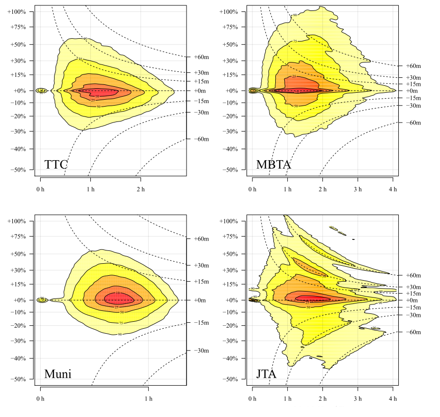

# Revisão da Literatura


Esse capítulo tem como objetivo principal confirmar e analisar as lacunas identificadas na introdução do trabalho. Ele começa mostrando a utilização do *big data* no planejamento urbano de transportes, com todas suas potencialidades e limitações. É reservado um tópico para método de consolidação e integração do *big data* de transporte público.


O segundo tópico foca na acessibilidade, começando com uma introdução do conceito e dos tipos de indicadores. Em seguida, são abordados métodos de estimação desses indicadores, com uma atenção para novas metodologias que surgiram a partir da padronização dos dados da oferta de transporte público através do GTFS. Por fim, são analisados os trabalhos que já utilizaram big data de transporte público na estimação da acessibilidade. Um foco é dado à utilização dos dados de GPS na acessibilidade, onde é feita uma tentativa de apresentar o estado da arte da integração dos dados de GPS e GTFS e suas principais lacunas. Por fim, é analisada a incipiente utilização de dados de bilhetagem na estimação da acessibilidade.


## Big data de transporte público e seu uso no planejamento urbano


A National Science Foundation define big data como bases de dados grandes, diversas, complexas e longitudinais que são geradas por instrumentos, sensores, e transações na internet (National Science Foundation, 2011). Indo além, @Kitchin2013 cita que não há um acordo sobre a definição do termo, e busca em diversas fontes na literatura as principais características do big data:

* grande em volume: até penta bytes de data;
* alto em velocidade: dados criados em tempo real;
* diverso em variedade;
* exaustivo no seu alcance: dados quase populacionais;
* alta resolução: o mais detalhista possível;
* relacionável por natureza: contém campos em comum que permitem a junção de várias bases;
* flexível: pode se estender tanto em atributos como em tamanho.


O autor ainda estabelece que as fontes de big data podem ser divididas em três categorias: direcionadas, automatizadas e voluntariadas. Dentro dos dados automatizados, são citados os dados gerados por sensores embutidos em objetos, como são sensores de GPS presentes nas frotas de transporte público, e dados gerados por cartões de viagens [@Kitchin2013], como é o caso de smartcard. De fato, é possível analisar como dados de smartcard e de GPS satisfazem as características acima estabelecidas:


* volume: dados de smartcard podem gerar até 6 milhões de registros em um dia para um sistema grandioso como o do metrô de Nova Iorque [@Barry2002] e dados de GPS podem gerar até 24 milhões de registros de localização diários (exemplo de @Arbex2016 para São Paulo);
* velocidade: ambas as bases de dados são geradas em tempo real; dados de smartcard são registrados a cada validação no transporte público e dados de GPS são gerados a cada 30s (exemplo de @Cortes2011);
* exaustivo: grande parte dos sistema de smartcard no mundo apresentam uma adesão maior que 80%; dados de GPS estão presentes em toda a frota ou na sua grande maioria;
* resolução: dados de smartcard apresentam informações ao nível do usuários com detalhamento de características da viagem; dados de GPS apresentam localizações com precisão e informações adicionais como a direção;
* relacionável: as duas bases principais são integráveis - maior parte dos sistemas de smartcard não apresenta a localização, então é feita uma integração das duas bases.


Estabelecido o que é considerado como big data de transporte público, é importante detalhar essas bases de dados e como tem sido feita sua utilização no planejamento dos transportes.


### Smartcard


O smartcard é um tipo de cartão que utiliza ondas de alta frequência para se comunicar com um leitor, dessa forma servindo para propósitos de identificação, autorização e/ou pagamento. O cartão, equipado com memória e um microprocessador, pode ser usado tanto para guardar informações como para executar tarefas pré programadas [@Pelletier2011].


Essas características fizeram o smartcard ser usado mundialmente para a coleta de tarifa nos sistemas de transporte público. No começo da sua implementação, sistemas de smartcard foram escolhidos por quatro razões principais: redução de custos, melhora no serviço, flexibilização da política de pagamento e aumento do lucro [@McDonald2000]. @Pelletier2011 detalham as vantagens dessa forma de pagamento, citando uma maior conveniência para os usuários, menor atraso, facilidade de monitoramento e segurança. No Brasil, o sistema, que é chamado de Sistema de Bilhetagem Eletrônica (SBE), já é usado por mais de 77% dos municípios com mais de 50 mil habitantes [@Correa2013].


As razões da implementação do sistema acima citadas, entretanto, não incluem outra importante potencialidade: a utilização dos dados secundários de viagem dos usuários. Cada validação de um cartão pode registrar a hora, localização, tipo de pagamento e linha utilizada. Órgãos provedores de serviço de transporte podem ter acesso a um grande volume de dados de viagens pessoais, cobrindo longos períodos de tempo. Em relação à métodos tradicionais de coleta de dados de transporte público como a contagem de tickets e pesquisas domiciliares, dados de smartcard permitem reconstruir padrões de deslocamento individuais, com a capacidade de atrelar viagens à dados pessoais e socioeconômicos dos usuários [@Bagchi2005].


Diversos estudos utilizaram dados de smartcard para auxiliar no planejamento de transportes. @Pelletier2011 propõe uma divisão em estudos de nível estratégico, tático e operacional. Estudos no nível estratégico estão relacionados ao planejamento da rede ao longo prazo, análise do comportamento dos usuários e previsão da demanda (Exemplo: @Agard2006 utilizou técnicas de data mining (clusterização e classificação) para desvendar hábitos de deslocamento). Estudos no nível tático estão focados principalmente no ajuste do serviço e estimação de padrão de deslocamento, enquanto que estudos no nível operacional estão focados na estimação de indicadores operacionais. @Kurauchi2017 reuniram diversos trabalhos que mostram a potencialidade do big data (especialmente dados de smartcard):


* Estimação de matriz OD: é a frente que mais utiliza dados de smartcard e GPS, contando com um método consolidado (exemplo: @Munizaga2012);
* Estimação de motivo da viagem: dados de bilhetagem não registram o tipo de atividade realizada pelo usuário, então dados de pesquisa domiciliares são utilizados para calibrar modelos de árvore de decisões para estimar o motivo da viagem de cada usuário;
* Modelagem da escolha de viagens: com uma matriz OD já estimada (com informações de transferências e linhas utilizadas), os dados podem ser utilizados para a calibração de funções de custo generalizado com a própria escolha do usuário; além disso, atributos importantes para os usuários como lotação do veículo podem ser incorporados ao modelo;
* Modelagem baseada em agentes: a natureza desagregada dos dados provenientes de bilhetagem torna sua utilização adequada em modelos baseados em agentes. Uma aplicação foi proposta para um sistema em Singapura;
* Estimação de indicadores para avaliar o sistema de transporte: cálculo de indicadores como viagens por segmento, velocidade média, tempo de viagem, pontualidade, passageiro-quilômetro, lotação, consistência de headway são possíveis a partir dos dados, oferecendo ferramentas para avaliar o sistema de transporte público.


### GPS (AVL)


Automated Vehicle Location (Localização Automática de Veículos) é a tecnologia de rastreamento de veículos da frota de transporte público. A evolução das tecnologias de rastreamento culminou na utilização de GPS (Global Positioning System) como a principal tecnologia de rastreamento automático. Sistemas de AVL estão inseridos dentro de um sistema de AVM (Automated Vehicle Monitoring) que, dentro do seu escopo original, incluem utilizações no controle e monitoramento automático de veículos, localização de emergência e implementações de priorização em sinais [@Townes1997].


A crescente adoção de sistemas de monitoramento da frota com o uso de GPS permitiu a geração de dados secundários de localização para o uso no cálculo de indicadores da qualidade do serviço, como velocidade operacional, frequência, horas em serviço, pontualidade, confiabilidade e outros [@Brinckerhoff2013].  @Bertini2003 utilizaram dados de AVL (agregados ao nível da parada de ônibus) e contagem de passageiros para estimar dezenas de indicadores e medidas para o sistema de Portland, EUA, incluindo indicadores de frequência, regularidade, índices de acessibilidade e lotação. @Utsunomiya2006 propuseram alguns indicadores de nível de serviço para o transporte público da cidade de Chicago, EUA.  


### Consolidação e geoprocessamento de big data de transporte


Grande parte do _big data_ de transporte público precisa passar por etapas de consolidação e tratamento espacial para fornecerem informações que subsidiarão análises.


Bilhetagem
Dados de bilhetagem geralmente não apresentam informação de onde aconteceu a validação, o que torna necessário a aplicação de métodos utilizando outras bases de dados. O método de georreferenciamento depende do sistema em que o estudo foi feito. Sistemas de metrô como o @Barry2002 já apresentam a estação de validação nos dados de smartcard, sendo esse local escolhido como local de embarque. Para sistemas que incluem ônibus, onde a validação é registrada dentro do veículo, muitas vezes os dados brutos de bilhetagem não apresentam a localização da validação, e sim a hora. Para isso, fontes de dados auxiliares como AVL e GTFS são utilizadas para realizar a integração e estimar o local de validação.


@Zhao2007 é o primeiro autor a explicitar a metodologia de integração da base de dados do *smartcard* e da base de dados AVL (GPS). Para integrar as bases, os autores utilizam a coluna busid comum entre as bases e fizeram uma junção buscando os horários mais próximos, conseguindo incorporar a coluna com a parada de ônibus na base de smartcard. 


@Farzin2008 também descreve o método de integração das bases de smartcard e GPS com o intuito de estimar a localização das validações. Além da base de smartcard e GPS, o autor conta com a base da localização (ponto e zona) de todas as paradas do sistema de transporte público de São Paulo. A primeira etapa é localizar a parada mais próxima de cada transmissão do arquivo de GPS. Depois, cada validação é associada ao registro de GPS, resultando em uma base de smartcard com a zona de validação.


Posteriormente, a maioria dos trabalhos utilizou uma metodologia de integração semelhante à dos autores acima para estimar o local de validação. Como exceção, o trabalho de @Nassir2011 não dispunha de uma frota rastreada, então os autores utilizaram horários agendados de parada dos ônibus da base de GTFS para estimar o local da cada validação.


Todos os trabalhos analisados tiveram como premissa implícita de que o local de validação do usuário no dia base representava o seu local mais provável de embarque, com exceção do trabalho de @Farzin2008. O autor identifica que para o sistema de ônibus de São Paulo os usuários têm a opção de não validar imediatamente quando sobem no ônibus, podendo permanecer numa área de pré-validação até que julguem necessário validar. É ressaltado que isso pode causar incertezas na estimação do real local de embarque, e o autor defende que uma agregação das viagens por zonas pode diminuir esse efeito. A agregação, entretanto, faz com que matriz resultante perca em resolução e precisão.


GPS
Dados de AVL a partir de GPS geralmente são muito volumosos e de difícil manuseio, não apresentando informações importantes como linha, viagem, e sentido. Isso trouxe a necessidade do estabelecimento de métodos para o tratamento e geoprocessamento desses dados. @Quiroga1998 definiram diretrizes para o uso de dados de AVL no cálculo de tempos de viagem e velocidade operacional. Embora tenham utilizado veículos particulares equipados com equipamentos de GPS para realizar a coleta, o estudo definiu uma metodologia para a consolidação e tratamento dos dados. Para lidar com a grande quantidade de registros (especialmente para a época, em que o proposto eram registros de localização a cada 1 segundo), essa metodologia determinava a agregação dos registros de localização por links das vias, como checkpoints a cada descontinuidade (interseções semaforizadas, interseções não semaforizadas importantes, descidas e rampas). A partir disso, o trabalho propôs a utilização de ferramentas GIS para a associação de cada registro de GPS ao link mais próximo.


De forma semelhante, @Cortes2011 utilizaram dados de localização da frota de Santiago, Chile, para fazer um diagnóstico da velocidade operacional do sistema de transporte público. O estudo contou com dados de uma semana de localização a cada 30 segundos de mais de 6000 ônibus, totalizando mais de 44 milhões de registros. As linhas de ônibus eram georreferenciadas em forma de pontos, então o primeiro passo do método foi transformar todos os pontos em linhas o mais simples possíveis. Em seguida, o método proposto alocou cada registro de localização à linha específica do ônibus consolidada, visto que os pontos de GPS apresentavam um pequeno erro de localização.


Para unificar os registros de GPS espacialmente e temporalmente, os autores propuseram um diagrama espaço-tempo. O diagrama determina intervalos espaciais e temporais isocrônicos, onde a velocidade média em cada segmento é a soma da distância viajada por todos os ônibus dividido pelo tempo viajado de todos os ônibus. Os registros de GPS, entretanto, dificilmente estão localizados próximos ao inícios dos segmentos. Para isso, todos os registros são interpolados ou extrapolados linearmente no tempo ou no espaço, significando que é assumido que o ônibus mantém uma velocidade constante entre o registro do GPS e o segmento.


Os estudos citados acima utilizaram informações não padronizadas da rede viária para o geoprocessamento dos dados de GPS. A criação dos dados de GTFS, por outro lado, criou novas oportunidades para a padronização da metodologia na limpeza, integração e geoprocessamento dos dados de GPS. @Arbex2016 e @Rabay2017 são exemplos de estudos que propuseram a integração das bases.


Como observado acima, os estudos da utilização de big data no planejamento urbano focam na estimação de indicadores e no estudo do padrão de deslocamento dos usuários. Ainda não foi muito estudado o papel que esses dados podem ter na estimação de indicadores de acessibilidade e na sua análise. As metodologias de integração dos dados de GPS com os dados de GTFS utilizadas por @Arbex2016 e @Rabay2017, apesar de serem usadas para a estimação de indicadores operacionais, apresentaram avanços na integração das bases, e terão destaque na próxima seção. A seguir, é delineado o conceito de acessibilidade e é feita uma revisão dos esforços que já foram realizados buscando utilizar esse big data na estimação da acessibilidade, avaliando ainda onde é possível fazer contribuições.


## Acessibilidade e métodos para estimação


O conceito clássico de @Hansen1959 define acessibilidade como o potencial de oportunidade de interação no espaço urbano. Em uma reflexão mais recente, @Geurs2004 entendem a acessibilidade como o que oferece oportunidades para indivíduos participarem em atividades no espaço urbano, sendo também utilizada para medir o impacto que políticas e intervenções nos sistemas de uso do solo e transporte tem no funcionamento da sociedade. Diante da complexidade do conceito, os mesmos autores identificaram quatro componentes da acessibilidade: 


* Componente de **uso do solo**: representa a quantidade, qualidade e espacialização de oportunidades ao longo do espaço urbano;
* Componente de **transportes**: expressa a impedância enfrentada pelo usuário para acessar certa oportunidade utilizando certo modo de transporte;
* Componente **temporal**: representa as limitações impostas pelo tempo para o acesso de oportunidades;
* Componente **individual**: representa as limitações e necessidades inerentes à cada indivíduo que busca acessar oportunidades no espaço urbano.


Esses quatro componentes apresentam uma forte ligação entre si, e idealmente uma medida de acessibilidade deveria conter todos integralmente. Na realidade, entretanto, dificilmente um indicador de acessibilidade consegue incorporar todas as dimensões e intra-relações. Comumente, uma medida apresenta uma foco maior em um ou dois dos componentes enquanto leva em consideração apenas alguns aspectos dos demais. 


De forma a avaliar a participação de cada um desses componentes nas medidas de acessibilidade, @Geurs2004 propuseram dividir os indicadores em:


* Baseados em **infraestrutura**: medidas focadas no componente de transporte, como **velocidade média** ou **nível de congestionamento**; marginalmente incorporam o componente temporal e individual;
* Baseados em **locais**: medidas focadas no componente de uso do solo, focadas na macroacessibilidade, incorporando também integralmente o componente de infraestrutura, como **quantidade de oportunidades que podem ser alcançadas em 30 minutos de viagem**;
* Baseados em **pessoas**: medidas focadas no indivíduo, como **atividades em que certos indivíduos podem participar** (dados suas restrições); comumente são de difícil mensuração visto que dependem de dados detalhados de cada indivíduo;
* Baseados em **utilidade**: medidas baseados em modelos econômicos que buscam estimar a **utilidade** (benefício) que é conquistada ao acessar atividades.


Cada uma das medidas pode ser adequada a diferentes realidades, usos e disponibilidade de dados. Por exemplo, se o objetivo é disseminar e comunicar resultados de análises de acessibilidade para tomadores de decisão, uma medida baseada em utilidade talvez não seja ideal, visto que peca na sua **interpretabilidade e comunicabilidade**, ainda pecando na sua **operacionalidade** (é necessário um extenso processo de coleta e modelagem dos dados). Nesse caso, medidas baseada em locais são adequadas porque são de fácil interpretação e comunicação. Se o objetivo, entretanto, for uma medida que incorpore de forma mais completa todos as dimensões do conceito, a medida de utilidade talvez seja adequada.


### Estimação da acessibilidade por transporte público


Até a metade da década de 2000, a estimação de indicadores de acessibilidade por transporte público se baseava em informações simplificadas das redes de transporte [@Owen2015]. Muitas vezes uma rede de transporte público consistia de linhas de ônibus que tinham informações como velocidade média e frequência que possibilitavam o cálculo do tempo de viagem da linha, e a assim a estimação de tempos de viagem entre pares origem-destino.  Essas simplificações podem acarretar em imprecisões no valor do indicador de acessibilidade, visto que tempos de viagem podem variar drasticamente durante o dia e entre trechos percorridos. Além disso, não conseguiam incorporar etapas importantes do deslocamento como o tempo de espera inicial e o tempo de espera por integrações [@Lei2010].


Pensando nessas limitações, @Lei2010 estabeleceram métodos conceituais e computacionais para a utilização da tabela de horários de um sistema de transporte público para estimar com maior precisão o tempo de viagem entre pares origem destino. O trabalho buscou definir explicitamente cada etapa do deslocamento por transporte público no seu método:
* Primeiramente, são especificadas as coordenadas da origem e destino e o horário de partida da viagem;  
* É assumido que o usuário vai caminhar do ponto de origem até a rua mais próxima;
* A partir dessa rua mais próxima, é calculado (através de um algoritmo Dijkstra de caminho mínimo) o menor tempo de viagem até o ponto de destino, considerando: o tempo de caminhada à parada, o tempo de espera pelo veículo, o tempo de espera por possíveis integrações, e o tempo de caminhada até o ponto de destino.


A viabilidade do método foi testada para um caso em Santa Bárbara, Califórnia, de onde os autores dispunham das informações da rede e dos horários do sistema de transporte público. Aplicando o algoritmo no software de geoprocessamento ArcGis, o trabalho calculou tempos de viagem de uma origem para as demais localidades da cidade.


De forma semelhante, @Benenson2010 desenvolveram uma extensão para ArcGIS para calcular o tempo de viagem mínimo entre pares origem destino. O Urban.Access, como foi chamada a extensão, permitia que o usuário determinasse parâmetros para o roteamento como velocidade de caminhada, máxima distância de caminhada, tempo de viagem total máximo e máximo de integrações permitidas.


Os métodos definidos nos trabalhos acima ainda tomava como input dados não padronizados da rede de ruas e da oferta de transporte público. A criação do formato de arquivo GTFS em 2005 (General Transit Feed Specification) abriu novas possibilidades para o uso de informação da oferta de transporte público no planejamento de transportes. Esse formato é composto de diversos arquivos .txt que delimitam informação sobre a oferta de transporte público de uma cidade, definindo tarifas, itinerários, horas de serviço, paradas, e horários programados. Dessa forma, o órgão de transporte da cidade pode disponibilizar todas as informações da oferta do seu sistema de transporte público e divulgar o arquivo .zip com todo o seu conteúdo.


A sua adoção como formato padrão de consolidação de dados de transporte público por milhares de agências de transporte do mundo possibilitou a criação e padronização de ferramentas para sua análise. Entre elas podem ser citadas ferramentas de roteamento, que utilizam as informações do GTFS para escolher o melhor caminho entre dois pontos, como módulos padronizados especiais para o *software* de geoprocessamento ArcGIS e ferramentas gratuitas e de código aberto como o *OpenTripPlanner*. Além disso, serviços como o GoogleMaps e o HereMaps são baseados em dados de GTFS para fornecer informações de rota para o usuário. 


Apesar de terem natureza e interfaces diferentes, as duas principais ferramentas (ArcGIS e OTP) tomam como *input* um arquivo de GTFS e a rede de vias da cidade para a construção de um objeto que represente a cidade como um *network*, onde as paradas de ônibus atuam como nós, os horários agendados entre paradas atuam como *edges*, e o tempo de viagem entre paradas atua como o custo [@Wessel2017]. Dessa forma, aplicam uma algoritmo de caminho mínimo e retornam como *output* o tempo de viagem entre pontos desejados, considerando as etapas de caminhada, espera, integração e tempo do dentro de veículo, de forma semelhante aos algoritmos produzidos por @Lei2010 e @Benenson2010.


Com os dados de GTFS e ferramenta disponíveis, diversos estudos estimaram tempos de viagem entre pares origem destino para subsidiar o cálculo de indicadores de acessibilidade por transporte público. Trabalhos como @Owen2015, @El-Geneidy2016a, @Wessel2017, @Mayaud2018 e @Pereira2019 utilizaram dados de GTFS e o *OpenTripPlanner* para estimar tempos de viagem entre pares origem destino, enquanto trabalhos como @Mavoa2012, @Benenson2010, @Farber2014, @Farber2017 e @Stepniak2019 utilizaram a ferramenta do ArcGIS. Além de evoluir no componente do transporte da acessibilidade, esses trabalhos também apresentaram avanços no componente temporal. Análises de acessibilidade dinâmicas como as feitas por @Owen2015, onde foram calculadas matrizes de tempo de viagem a cada 1 minuto, seriam impensáveis num contexto anterior. 


Em relação aos demais serviços como o GoogleMaps e o ArcGIS, a utilização do OTP apresenta sua principal vantagem no fato de ser *open source* e gratuito. Num contexto de cálculo de acessibilidade, onde consultas são feitas de todos os pontos da cidade para todos os demais pontos, o custo de utilizar serviços pagos seria inviável para o projeto. 


Para realizar o roteamento, o OTP precisa, além dos dados de GTFS, de informações da rede de ruas da cidade, e essa informação deve ser extraída da plataforma *open source OpenStreetMap* (OSM). Simplificadamente, o OSM é uma base de dados (e visualização) de vias e informações do uso do solo análoga ao GoogleMaps, com a diferença de ser aberta e colaborativa. A rede de vias é utilizada como base para definir os deslocamentos a pé de acesso e difusão do sistema.


A utilização desses dados, entretanto, ainda apresenta algumas limitações importantes. Os estudos analisados acima assumem como uma premissa implícita a de que os horários programados fornecidos pela agência de transporte são confiáveis. É sabido, entretanto, que horários programados podem diferir significativamente dos horários reais. Como exemplo, @Mandelzys2010 desenvolveram e aplicaram uma metodologia para avaliar a adesão de uma linha de ônibus aos horários programados na cidade de Ottawa, Canadá. Utilizando 4 meses dados de GPS, os autores identificaram que em dois terços das paradas da linha o ônibus ou chegou atrasado (> 5 minutos atrasado) ou adiantado (> 30 segundos adiantado). Recentemente, @Wessel2019a avaliaram a aderência para os sistemas da cidades de Toronto (Canadá), São Francisco, Boston e Jacksonville (Estados Unidos). Eles mostraram que, apesar da maioria dos tempos de viagem se comportarem bem (+- 15% de variação do horário programado), a variação pode chegar até 100% em alguns sistemas. Além disso, há uma simetria nos atrasos, o que indica que as agências adotam critérios conservadores na determinação dos tempos de viagem (Figura \ref{fig:wessel-2019}).


```{r wessel-2019, fig.cap = "Análise da pontualidade de Toronto (esquerda, acima), São Francisco (esquerda, abaixo), Boston (direita, acima) e Jacksonville (direta, abaixo)", fig.subcap = "Adaptada de Wessel (2019)"}


```

No SIT-FOR, a agência de transporte fornece para o Google (que é quem faz o processamento final do GTFS) informações de horários programados somente do começo e do fim de cada viagem, que são os horários que são utilizados pela ETUFOR para o controle e operação do sistema. A informação de tempo de viagem de cada veículo entre paradas, que é uma informação necessária nesse formato de GTFS, não é fornecida, ficando ao cargo do Google a estimação. O método utilizado pela empresa é desconhecido.


Portanto, a literatura aponta para a necessidade de métodos e dados para melhorar a qualidade dos dados de GTFS, por conseguinte aprimorando a estimação de tempos de viagem entre pares origem-destino e o cálculo de indicadores de acessibilidade. Para esse fim, dados de localização da frota (AVL) e bilhetagem (*smartcard*) podem ser utilizados.


### Como o big data pode ajudar na estimação?


Como já foi visto no começo do capítulo, dados de GPS são usados principalmente para o controle do sistema e estimação de indicadores operacionais de desempenho. Apesar de incipiente, esforços têm sido feitos para incorporar dados de localização da frota na melhoria da estimação de indicadores de acessibilidade por transporte público. Os métodos desses trabalhos buscam transformar dados brutos de localização da frota em uma tabela de horários dos veículos no estilo *stop_times.txt* do GTFS.


Destaca-se o trabalho de @Wessel2017, que utilizou dados de GPS de Toronto, Canadá, para corrigir os dados de GTFS. Os dados de GPS eram disponibilizados em tempo real através de uma API do serviço *NextBus*, que automaticamente detecta a linha, o sentido, e quando havia o fim de uma viagem e começo de outra. O algoritmo desenvolvido pelos autores coletou dois dias de registro, e primeiramente buscou detectar erros nessas informações. Em seguida, os autores estabeleceram um *buffer* de 20 metros em relação a cada parada (coletada a partir do GTFS da cidade) para estabelecer o ponto de GPS (e a hora), estimando os tempos de parada de cada viagem. 


Com a estimação do tempo de parada de cada viagem feita (e já com as informações de linha, sentido, e veículo), o novo arquivo já era análogo ao arquivo agendado *stop_times.txt*, e foi utilizado para o roteamento pelo *OpenTripPlanner* e a estimação do tempo de viagem entre pares origem destino (no caso, setores censitários). Por fim, foram calculados indicadores de acessibilidade cumulativa para empregos em até 45 minutos de viagem antes e depois da correção.


Os autores demonstraram que muitas vezes o horário agendado das viagens do transporte público da cidade é conservador, levando à subestimação do indicador de acessibilidade. A principal conclusão do estudo, entretanto, é que a variação entre o horário agendado e real parece não ser aleatória, afetando diferentemente certas regiões da cidade (Figura \ref{fig:wessel-2017}).

``` {r wessel-2017, fig.cap = "Diferença relativa de acessibilidade entre acessibilidade programada e corrigida", fig.subcap = "Adaptada de Wessel (2017)"}

```

Com um objetivo de trabalho diferente, @Arbex2016a também utilizaram de dados de GPS para corrigir os arquivos de GTFS para o sistema de transporte público de São Paulo. A metodologia de transformação dos dados de GPS em dados *stop_times.txt* de GTFS não foi detalhada, mas entendeu-se que o autor adaptou a mesma metodologia do seu trabalho anterior [@Arbex2016].


Neste trabalho, com um objetivo de fazer análise *ex-post* de faixas exclusivas, os autores utilizaram 20 dias úteis de agosto de 2013 (sem faixa exclusiva) e 20 dias úteis de abril de 2015 (com faixas exclusivas) de dados de GPS arquivados. O trabalho propôs fazer uma integração com os dados de oferta do sistema disponíveis no arquivo de GTFS, agregando os registros de GPS a cada parada de ônibus, sem interpolação linear. A metodologia de geoprocessamento dos dados de GPS proposta respeitou, resumidamente, as seguintes etapas:


* **Leitura dos dados**: os dados referentes aos registros de GPS e às paradas de ônibus servidas por cada linha (*stops.txt* e *stop_times.txt* dos dados de GTFS) foram armazenados;
* **Filtro espacial**: registros de GPS que erroneamente foram localizados fora da cidade de São Paulo foram excluídos;
* **Ordenação**: os dados de GPS são ordenados por linha, veículo e hora;
* **Associação ao ponto de ônibus mais próximo**: cada registro de GPS foi alocado à parada mais próxima, de acordo com a linha em questão;
* **Filtro espacial**: registros de GPS que apresentaram uma distância maior que 200 metros da parada mais próxima foram descartados;
* **Separação de viagens**: viagens diferentes são identificadas através de uma diferença abrupta entre as paradas do registro do GPS: se em um registro (já ordenado por linha e por hora) foi identificado a parada 88 da linha e no registro seguinte foi registrada a parada 2, determina-se que houve uma mudança de viagem;
* **Correção das viagens**: a correção envolveu interpolação quando houve parada sem um registro de GPS, quando houve alguma inconsistência na rota do ônibus, ou quando houve dados repetidos devido à parada do veículo.


A principal limitação identificada no trabalho foi o método para estimar o tempo de passagem de cada veículo pelas paradas da linha. O autor associou o registro de GPS mais próximo de cada parada como sendo o horário associado, utilizando um limite de 200 metros (em distância euclidiana) para julgar se aquela associação foi válida ou não. Isso significa que um registro de GPS com até 200 metros de distância da parada pode ser utilizado, o que pode acarretar erros de estimação.


Outra limitação do método de tratamento dos dados de GPS foi que, para evitar problemas, o autor não considerou as paradas extremas (de fim e de começo da viagem). Isso pode ser problemático especialmente em áreas de terminais, onde há um grande fluxo de veículos e onde atrasos e altos tempos de viagem são comuns. Além disso, não foi deixado claro se foi estabelecido um método para identificar o sentido da viagem, ou se essa informação já seria disponibiliza automaticamente.


Com isso, o autor pôde estimar tempos de viagem (entre zonas de tráfego) com o uso do software *ArcGis* e calcular e analisar indicadores de acessibilidade, mas não fez uma análise comparativa da acessibilidade com o GTFS programado e com o GTFS empírico. 


No que se refere à fonte de dados, a principal diferença entre os trabalhos de @Wessel2017 e @Arbex2016a está no fato de que o primeiro contou com dados de GPS que eram coletados em tempo real de um serviço, através de uma API, que já contava com informações de viagem e sentido da linha, enquanto que o último contou com dados arquivados de GPS, com mais carência de informações. Essa diferença levou o trabalho de @Arbex2016a, na tentativa de obter informações já disponíveis ao trabalho de @Wessel2017, a adotar uma metodologia de geoprocessamento dos dados de GPS mais extensa e elaborada, trazendo mais contribuições para a aŕea.


O serviço de dados de GPS utilizado por @Wessel2017 está presente em mais de 50 cidades, porém concentrado nos Estados Unidos, Canadá e Austrália (informação coletada em agosto de 2019 no site  https://nextbus.cubic.com/Our-Customers/Around-the-World). Identifica-se, portanto, que a metodologia desenvolvida no trabalho de @Arbex2016a pode ser mais útil para a realidade dos demais países (especialmente países emergentes), onde a tendência é a disponibilização de dados de GPS arquivados e carentes de informações.


Outro aspecto importante a ser ressaltado é como foi feita a agregação temporal dos dados. @Wessel2017 teve acesso a localização de todos os veículos do sistema por 2 dias, com exceção das linhas de alta capacidade, que o autor utilizou os dados programados. Então calcularam a acessibilidade para o serviço observado nesses dias, por fim fazendo uma acessibilidade média dessa amostra. @Arbex2016a aplicaram seu algoritmo para 20 dias úteis, mas não foi explicitado como os tempos estimados entre paradas foram agregados para um arquivo consolidado de *stop_times.txt*.


Esses são os trabalhos encontrados que realizaram uma transformação de dados de localização da frota em dados *stop_times* do GTFS, trazendo informações empíricas de tempo de viagem. Outros trabalhos, apesar de não terem feito uma tradução completa dos dados de GPS em dados *stop_times*, propuseram métodos para geoprocessar dados de GPS com uso dos dados de GTFS, estimando informações importantes de serviço. Como exemplo, destaca-se o trabalho de @Rabay2017, que utilizou os dados de GPS para estimar velocidades operacionais em trechos de algumas linhas, e merece uma atenção especial.


Ao contrário dos dados de GPS utilizado nos estudos de @Wessel2017 e @Arbex2016, os dados de AVL do SIT-FOR não possuem a informação da linha em que o carro está operando. Além disso, o número do veículo na base do GPS é diferente do número do veículo na base da bilhetagem. Com isso em mente, o trabalho de @Rabay2017, com o objetivo de estimar indicadores operacionais, propôs uma metodologia para identificar linha, sentido e viagem na base do GPS. Primeiramente, fazendo o uso de um dicionário de equivalência entre o número do carro nos dados de AVL e bilhetagem, o autor transpôs a coluna da linha da base da bilhetagem para a base do GPS. Em seguida, o autor utilizou os itinerários das linhas (a partir dos dados GTFS) para criar uma área de influência de cada uma delas. Dessa forma, pôde manter somente os registros de GPS que estavam contidos nas áreas de influência das linhas correspondente, eliminando pontos em trajetos fora da linha, que acontecem quando o veículo está indo pra garagem ou quando um mesmo carro serve a mais de uma linha.


Para determinar o sentido de cada viagem, o autor assumiu que todas as viagens que aconteciam eram no sentido da ida, e fez um snap de cada ponto de GPS para a linha do sentido de ida. Com isso, calculou a distância acumulada que o veículo percorria. Quando a distância acumulada aumentava, significava que o veículo estava indo no sentido da linha, ou seja, ida. Quando a distância diminuía, significava que estava voltando. Após alguns testes de qualidade, o autor dividiu a linha em diversos trechos e fez o snap dos pontos de GPS para esses trechos, podendo assim calcular indicadores operacionais.


Entretanto, o método não levou em consideração o tempo perdido no final e começo das linhas. Especialmente em terminais de integração fechados, leva-se muito tempo para manobrar e embarcar os usuários e, em certas situações, o veículo apresenta um tempo ocioso, sem operar. A não consideração desse aspecto pode fazer com que aconteça um erro na estimação da velocidade de operação. Além disso, a metodologia foi aplicada somente para um dia e 4 linhas, não sendo testada para todo o sistema de transporte público onde há diversas situações que podem tornar o método proposto impreciso.


### E como os dados de bilhetagem podem ajudar?


Como acontece com a utilização de GPS na estimação de indicadores de acessibilidade, a utilização de dados de bilhetagem recebe pouca atenção na literatura. O mesmo trabalho de @Arbex2016a analisado na seção anterior também fez uma análise utilizando dados de bilhetagem, onde os autores selecionaram cinco bairros de baixa renda de São Paulo e estimaram o tempo de viagem (motivo trabalho) de cada usuário do transporte público a partir dos dados de *smartcard*. Junto com a análise de um indicador cumulativo de acessibilidade,  os autores analisaram os percentis 50 e 90 dos tempos de viagem estimados. Em seguida, utilizaram o percentil 90 do tempo de viagem estimado de cada um dos bairros como o time threshold para o indicador cumulativo de acessibilidade, analisando a porcentagem de empregos acessíveis nesse tempo.


A utilização dos tempos de viagem a partir da bilhetagem para estabelecer limites de tempo em um indicador cumulativo vai de encontro à discussão proposta por @Paez2012 de acessibilidade normativa vs acessibilidade positiva. A acessibilidade normativa é implementada baseada em valores de distância ou tempo de viagem que são assumidos pelos autores, como, por exemplo, o tempo limite (*time threshold*) de acesso a oportunidades para um indicador cumulativo. A acessibilidade positiva é baseada no comportamento dos usuários para definir esses parâmetros de distância ou tempo de viagem, como, por exemplo, a utilização de uma matriz origem destino para calibrar um modelo gravitacional, ou o uso do tempo de viagem coletado em pesquisas para definir o tempo limite em indicadores cumulativos.


Os autores ainda argumentam que a diferença entre uma acessibilidade normativa e positiva pode ser significativa. Além disso, valores assumidos de tempo de viagem limite podem depender da cidade, atividade, grupo social, etc. @Pereira2019 mostra, por exemplo,  como uma análise de diferença de acessibilidade por faixa de renda pode mudar a conclusão dependendo do tempo limite utilizado no indicador cumulativo.


Por fim, o único trabalho encontrado que utilizou dados de big data de transporte público para a implementação de uma acessibilidade positiva foi o de @Arbex2016a. Falta na literatura ainda a consolidação de um método para a utilização desses dados para esses fins, e a diferença que eles trariam em comparação à utilização de valores normativos.


## Considerações finais


O primeiro tópico da revisão mostrou os principais usos do *big data* no planejamento de transporte público. Em seguida, métodos de consolidação e integração das bases de dados foram abordados. Um destaque especial foi dado ao geoprocessamento dos dados de GPS, principalmente na sua integração com os dados de GTFS. Algumas lacunas desta etapa foram identificadas e analisadas, tendo em vista que estão presentes na problemática deste trabalho.


O segundo tópico começou com uma introdução do conceito de acessibilidade, com os seus componentes e tipos. Em seguida, foi analisado o desenvolvimento dos métodos de estimação dos indicadores por transporte público ao longo dos anos, que culminou na utilização de dados padronizados da oferta de transporte público para a estimação do componente de transporte da acessibilidade. Esses dados, entretanto, apresentam problemas de confiabilidade devido ao fato de serem programados pela agência de transporte. Assim, foram analisadas as metodologias que já foram desenvolvidas para a correção desses horários programados com o uso de dados de localização da frota. Só o trabalho de @Wessel2017 focou em um método para a transformação de uma base de dados de GPS para um arquivo *stop_times.txt*, mostrando a importância de fazer essa transformação. Entretanto, foi identificado que os dados de GPS do trabalho são diferentes de dados de GPS arquivados comumente encontrados (inclusive do SIT-FOR). Dentro da realidade dos arquivos GPS arquivados, foram identificados alguns trabalhos que propuseram metodologias de utilização de dados de GTFS no tratamento de dados de GPS, mas com objetivos distintos.

No que diz respeitos às hipóteses levantadas nas questões de pesquisa, a primeira hipótese foi abordada pelo trabalho de @Wessel2017, mas entende-se que é necessário avançar nessa verificação e nas implicações que ela tem para a tomada de decisão e avaliação de alternativas. 

Para a segunda hipótese, foi identificada uma lacuna no que dizia respeito à utilização da amostra advinda dos dados de GPS. Os trabalhos encontrados utilizaram amostras de mais de um dia, mas no fim acabaram fazendo a média dos valores, de uma forma ou de outra. É entendido que as amostras coletadas podem ser utilizada para mais que uma análise mediana do sistema, principalmente em cenários onde o tempo de viagem por transporte público pode ser tão variável.

Para a terceira hipótese, muitos trabalhos já analisaram essa varibilidade: @Owen2015 introduziu o fenômeno, e mais recentemente @Stepniak2019 fez uma revisão de boa parte dos trabalhos que já abordaram a temática. Algumas lacunas adicionais podem ser observadas, como as atividades consideradas e as resoluções espaciais utilizadas.


Por fim, do lado dos dados de bilhetagem, foi identificada uma lacuna na utilização de dados de *smartcard* na estimação de indicadores positivos. @Arbex2016a propôs uma utilização para esses fins, mas entende-se que ainda é preciso discutir a utilização e consolidar métodos para tal.


Os métodos desenvolvidos neste trabalho então buscam abordar essas lacunas de pesquisa. Primeiramente, é necessário preparar os dados do transporte público de Fortaleza para em seguida estabelecer os métodos. A consolidação e integração dos dados se propõe a isso.