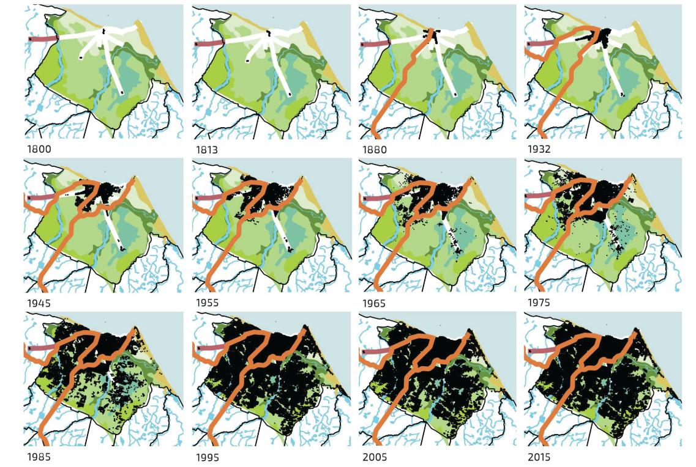
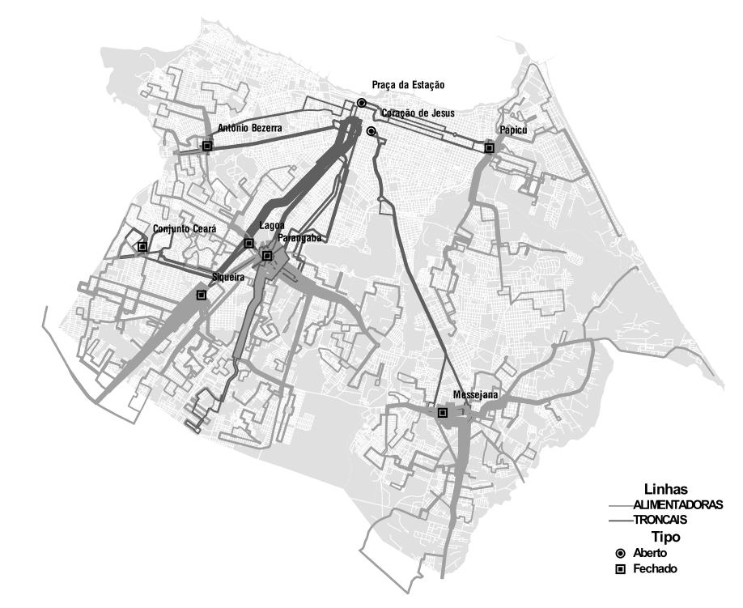
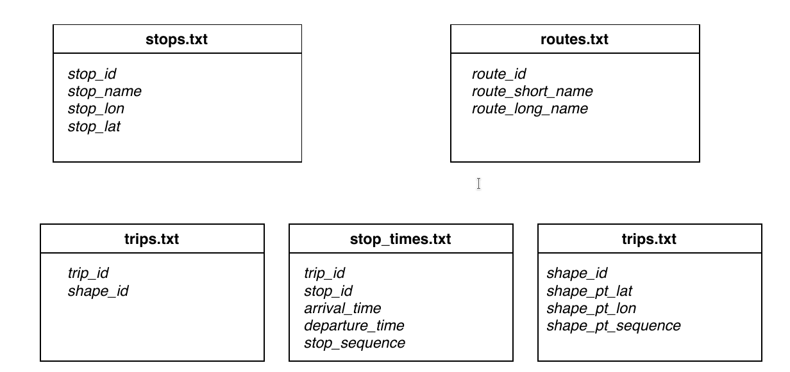
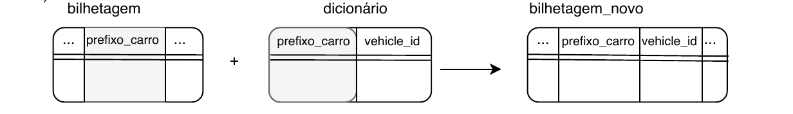
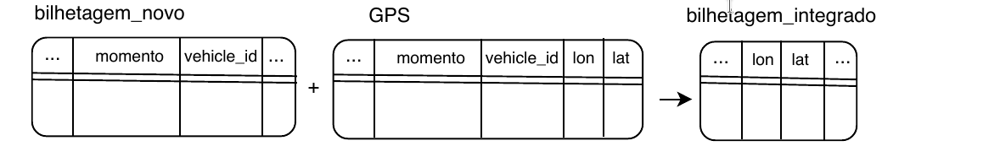
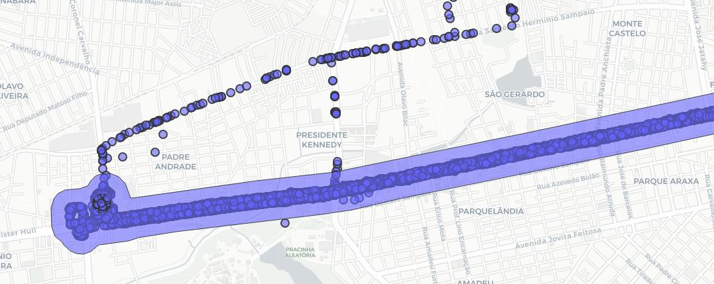
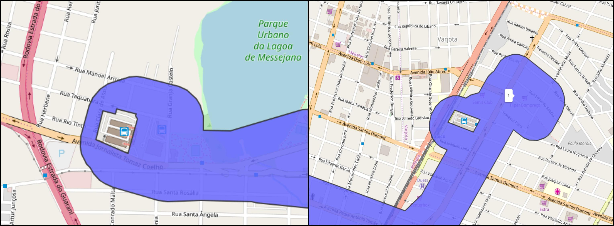
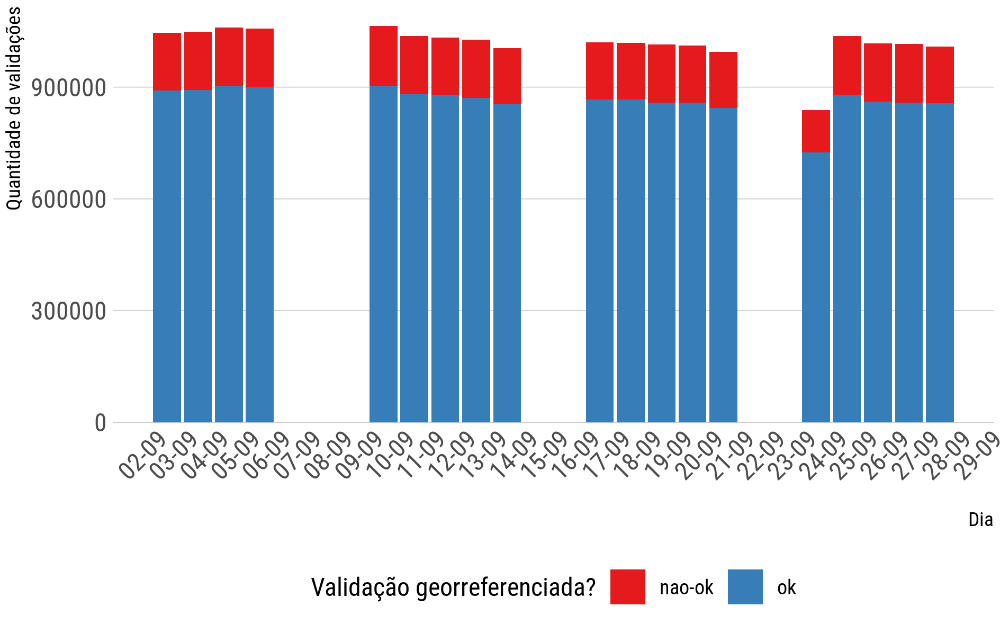
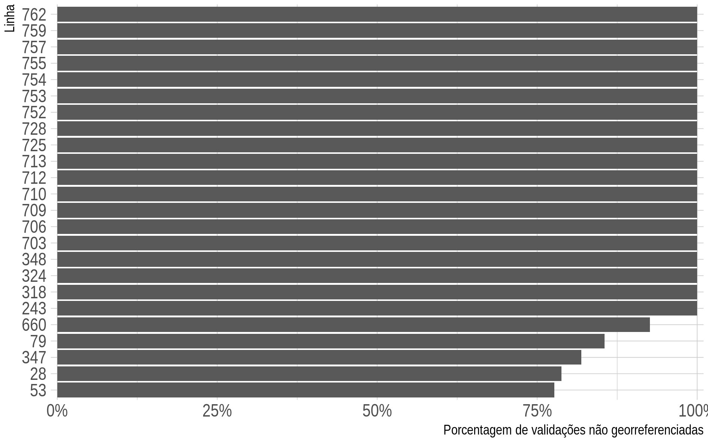
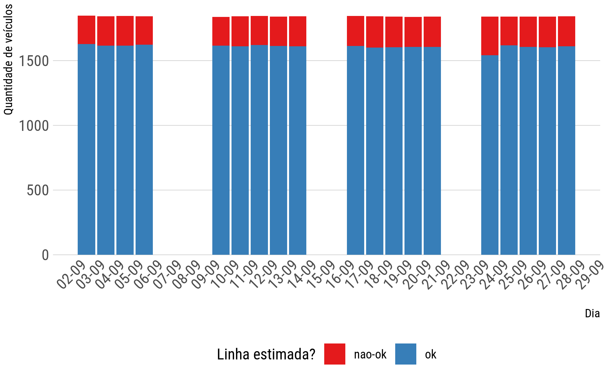

# Consolidação e Integração dos dados do SIT-FOR

A consolidação tem como objetivo fazer uma apresentação, preparar os dados para a sua disponibilização e para as etapas seguintes de estimação de indicadores de acessibilidade. O capítulo começa com uma contextualização do SIT-FOR. Em seguida, a consolidação proposta neste trabalho divide o processo em duas etapas principais: tratamento inicial dos dados e integração das bases. As bases utilizadas são: bilhetagem, GPS, cadastro dos usuários e GTFS. Por fim, são mostrados os resultados da consolidação, com as limitações amostrais ocasionadas pela integração das bases.


## Sistema de Transporte Público Integrado de Fortaleza (SIT-FOR)


A expansão da malha urbana de Fortaleza é mostrada na Figura \ref{fig:fortaleza-crescimento). Observa-se que a cidade começou a se desenvolver no centro, expandindo sua mancha urbana (em preto) para os bairros periféricos. De acordo com dados do Censo, Fortaleza cresceu de 270 mil habitantes em 1950 para quase 2 milhões e 500 mil habitantes em 2010 [@Fortaleza2040]. Essa expansão trouxe grandes desafios aos planejadores da cidade no que se refere aos transporte dessa nova massa de habitantes.

``` {r fortaleza-crescimento, fig.cap = "Expansão Urbana de Fortaleza", fig.subcap = "Fortaleza 2040"}


```
  

Após tentativas frustradas de organização dos serviços de transporte público, em 1992 foi criado o Sistema Integrado de Transportes de Fortaleza (SIT-FOR) pela então Empresa de Trânsito e Transporte Urbana S/A - ETUSA. O novo sistema de transporte público estabeleceu uma configuração tronco-alimentadora de operação, com a criação de terminais de integração fechados nos bairros e terminais abertos no Centro. As linhas alimentadoras levam os passageiros dos bairros até os terminais, e as linhas troncais levariam os passageiros dos terminais até a área central da cidade. Além disso, linhas complementares, circulares e inter bairros também foram implementadas [@Fortaleza2015]. A Figura \ref{fig:fortaleza-linhas} mapeia a configuração espacial do sistema. No mapa não estão presentes as linhas de transporte de alta capacidade (trem e VLT). Essas linhas ainda não estão operacionalmente e tarifariamente integradas ao sistema de ônibus de Fortaleza, além de apresentarem uma operação que está longe da sua capacidade. A Linha Sul opera em um intervalo de aproximadamente 15 minutos entre trens, a Linha Oeste em cerca de 30 minutos, e a linha do VLT está em operação assistida.
  
```{r fortaleza-linhas, fig.cap = "Linhas troncais e alimentadoras do SIT-FOR", fig.subcap = "Fortaleza (2010)"}

```

### Sistema de Bilhetagem Eletrônica E AVL de Fortaleza


O SIT-FOR têm um sistema aberto de bilhetagem eletrônica (usuários só validam no embarque) que registra a passagem de todos os usuários pela catraca dos veículos. Os tipos de pagamentos utilizados podem ser por bilhete único de vale transporte, carteira de estudante (mostrados na Figura \ref{fig:bu}), gratuidade de idosos, deficientes e funcionários, e inteira (pagamento por dinheiro). Já o sistema de *Automated Vehicle Location* (Localização automática de veículos) consiste na presença de equipamentos de GPS em todos os veículos da frota de transporte público de Fortaleza. O sistema registra a localização de cada veículo em média a 30 segundos quando o veículo está ligado.

```{r bu, fig.cap = "Cartões de Bilhetagem Eletrônica do SIT-FOR", fig.subcap = "Prefeitura de Fortaleza"}


```

## Tratamento inicial dos dados

O tratamento inicial dos dados busca converter os dados brutos para um formato sem informações desnecessárias e com as colunas nomeadas. A Figura \ref{fig:cons-tratamento-inicial} descreve as principais etapas.
  
``` {r cons-tratamento-inicial, fig.cap = "Tratamento inicial dos dados"}

include_graphics('figure/3-tratamento_inicial.png')

```


### Dados de smartcard

Os dados brutos de bilhetagem contém 9 colunas, sendo originalmente divididos por dia. Por meio de informações fornecidas pelo órgão fornecedor dos dados, foi possível nomear as colunas de acordo com o seu conteúdo:


* *id*: representa o código Siom do usuário, que é o código que identifica o usuário do cartão;
* *linha*: representa o código da linha onde aconteceu a validação;
* *nome_linha*: representa o nome da linha;
* *prefixo_carro*: numero do veículo de acordo com a ETUFOR;
* *hora*: a hora e o dia da validação, no formato ISO 8601 ano/mês/dia hora:minuto:segundo;
* *tipo_cartao*: código do tipo de cartão utilizado;
* *nome_cartao*: nome do tipo de cartão utilizado;
* *sentido_viagem*: o sentido da viagem (ida ou volta);
* *integracao*: se a viagem foi uma integração ou não.


A coluna tipo_cartao contém 9 tipos de pagamento diferentes. É simplificada para quatro tipos principais: *vale transporte*, *carteira de estudante*, *gratuidade* e *inteira*. As colunas *nome_linha* e *nome_cartao* são removidas por conterem informações correspondentes nas colunas *linha* e *tipo_cartao*. A Tabela \ref{tab:bi_sample} apresenta uma amostra desses dados já com a nomeação das colunas.
  
``` {r bi_sample, eval = FALSE}

bi_sample <- read_csv("../data/bilhetagem/2018/08/bilhetagem_2018-08-04.csv") %>%
  select(-nome_linha, -nome_cartao, -dia, -momento) %>%
  slice(1:10)

kable(bi_sample, format = "latex")
  
```

\begin{table}[!h]
\captionsetup{width=16cm}%Deixe da mesma largura que a tabela
\Caption{\label{tab:bi_sample} Amostra da base da bilhetagem}%
\IBGEtab{}{%
	\begin{tabular}{ccccccc}
		\toprule
		id & linha & prefixo\_carro & hora & tipo\_cartao & sentido\_viagem & integracao\\
		\midrule
		6626108 & 84 & 2007 & 2018-08-04 20:16:47 & Vale Transporte & Volta & S\\
    5488895 & 84 & 2007 & 2018-08-04 18:01:00 & Vale Transporte & Ida & S\\
    7173980 & 84 & 2007 & 2018-08-04 18:10:03 & Estudante & Ida & N\\
    4818496 & 84 & 2007 & 2018-08-04 18:16:54 & Vale Transporte & Ida & N\\
    7400045 & 84 & 2007 & 2018-08-04 17:27:54 & Vale Transporte & Volta & N\\
    3834561 & 84 & 2007 & 2018-08-04 17:37:07 & Estudante & Volta & N\\
    5300990 & 84 & 2007 & 2018-08-04 17:42:56 & Vale Transporte & Volta & N\\
    4616189 & 84 & 2007 & 2018-08-04 16:09:59 & Vale Transporte & Ida & N\\
    2674363 & 84 & 2007 & 2018-08-04 15:00:24 & Estudante & Ida & N\\
    2835333 & 84 & 2007 & 2018-08-04 14:04:42 & Gratuidade & Volta & N\\
		\bottomrule
	\end{tabular}%
}{%
\Fonte{Elaborada pelo autor}%
  }
  \end{table}

Em seguida, é feita a remoção de dados duplicados. Isso acontece quando o usuário erroneamente passa o seu cartão mais de uma vez, ou quando um usuário do cartão passa o cartão para diversos usuários. Para isso, validações de um mesmo usuário na mesma linha em um intervalo menor que 5 minutos entre elas serão removidas, mantendo somente a primeira validação.


### Dados de GPS


Cada veículo da frota de transporte público de Fortaleza é rastreado por um aparelho de GPS. Na maioria dos casos o aparelho registra a localização de cada veículo a cada 30 segundos. No total, cada registro desse de localização do veículo apresenta mais de 40 atributos (colunas), sendo grande parte vazios ou nulo.


Os dados brutos são fornecidos por mês, com cada arquivo ocupando cerca de 7,5 GB de espaço em disco e contendo cerca de 125 milhões de linhas. Para facilitar o manejo dos dados em um computador com poder de processamento médio, esses arquivos foram divididos por dia em um computador de processamento maior (> 16 GB de memória e 4+ núcleos). Por fim, foram mantidas somente as colunas que apresentavam informações necessárias:


* *vehicleid*: a identificação do veículo de acordo com o estabelecido pela empresa;
* *hora*: o dia e a hora exata da localização registrada;
* *lat*: a latitude onde se encontra o veículo;
* *lon*: a longitude.


Uma inspeção na base de dados mostrou alguns problemas que precisavam ser resolvidos. O mais grave dizia respeito a hora de cada registro. Primeiro, foram identificados dois formatos de data diferentes: um no formato ``anomesdiahoraminutosegundo`` (aaaammddHHMMSS) e outro no formato de data UNIX, que apresenta a quantidade de segundos passados em relação a certa data (geralmente em relação ao dia 1970-01-01 00:00:00). Enquanto o problema do primeiro formato é de resolução rápida (basta mudar o formato organizando o ano, dia, etc), o problema do segundo foi de difícil resolução porque não fazia sentido ser a quantidade de segundos a partir de 1970. Por meio de tentativa e erro foi identificado que o formato representava a quantidade de segundos passados desde a data 2000-01-01 00:00:00. A hipótese da correção foi confirmada por outras pessoas que já haviam tido contato com os dados.


Outro problema com a hora foi encontrado. Quando se fazia um histograma da quantidade de registros de localização por hora, a concentração dos pontos era contra-intuitiva, com uma maior concentração de pontos próximo das 9h e das 20h. Foi identificado então que a hora dos dados brutos sofreu uma modificação indevida para o fuso UTM, que é o fuso no meridiano de Greenwich e 3 horas a mais que o fuso brasileiro. 
  
Esses problemas foram então resolvidos e os arquivos de GPS consolidados foram salvos por dia no formato ``gps_2018-08-dd.csv``. Uma amostra da base é mostrada na Tabela \ref{tab:gps_sample}
  
``` {r gps_sample, eval = FALSE}

gps_sample <- read_csv("../data/gps/2018/novo/09/gps_2018-09-03.csv") %>%
  slice(1:10) %>%
  select(vehicleid = vehicle_vehicleid, hora, lon = longitude, lat = latitude)

kable(gps_sample, format = "latex")

```

\begin{table}[!h]
\captionsetup{width=10cm}%Deixe da mesma largura que a tabela
\Caption{\label{tab:gps_sample} Amostra da base do GPS}%
\IBGEtab{}{%
	\begin{tabular}{ccccccc}
		\toprule
		vehicleid & hora & lon & lat\\
		\midrule
		34489 & 2018-09-03 23:59:58 & -38.53342 & -3.878622\\
    32739 & 2018-09-03 23:59:55 & -38.56847 & -3.778345\\
    32739 & 2018-09-03 23:59:55 & -38.56847 & -3.778345\\
    32739 & 2018-09-03 23:59:55 & -38.56847 & -3.778345\\
    32736 & 2018-09-03 23:59:46 & -38.56870 & -3.778106\\
    32649 & 2018-09-03 23:59:27 & -38.56826 & -3.777836\\
    34489 & 2018-09-03 23:59:26 & -38.53342 & -3.878622\\
    36569 & 2018-09-03 23:59:25 & -38.56858 & -3.778086\\
    32127 & 2018-09-03 23:59:16 & -38.54580 & -3.744650\\
    32127 & 2018-09-03 23:59:16 & -38.54580 & -3.744650\\
		\bottomrule
	\end{tabular}%
}{%
\Fonte{Elaborada pelo autor}%
  }
  \end{table}


### Dados de GTFS


A Especificação Geral de Feeds de Transporte Público (GTFS) estabelece um formato para compartilhamento de dados de transporte público pelas agências reguladoras. Esse dados, fornecidos para o Google, contém informações de horários, itinerários das linhas e tarifa, permitindo que a empresa faça uso desses dados nos seus produtos (como no Google Maps) para fornecer rotas, estimações de tempo e custo monetário para o usuário.


O formato unificado apresenta os seguintes arquivos principais (Figura \ref{fig:tratamento_gtfs}):


* *stops.txt*: as paradas do sistema de transporte público e sua localização;
* *routes.txt*: informações básicas de cada linha de transporte público;
* *trips.txt*: as viagens realizadas por cada linha;
* *stop_times.txt*: o horário programado de chegada de cada veículo, em cada viagem, às paradas do sistema;
* *shapes.txt*: os pontos que definem cada rota das linhas do sistema de transporte público.

``` {r tratamento_gtfs, fig.cap = "GTFS e suas colunas"}



```


O tratamento inicial dos dados GTFS respeita as seguintes etapas:


* **Decodificação da coluna ``trip_id`` do arquivo *stop_times.txt***: para identificar a linha, viagem, e sentido, é necessário decodificar a coluna em questão. Isso permitirá a adequação do arquivo;
* **Criação de uma tabela (*paradas_consolidadas*) com as paradas servidas por cada linha, sentido e sua sequência, georreferenciados**: é criado um novo arquivo a partir da junção do arquivo *stop_times.txt* modificado e o arquivo *stops.txt* contendo todas as linhas, sentido, paradas, sequência e localização. Essa etapa é necessária para identificar a parada mais próxima de cada validação da bilhetagem;
* **Unificação dos pontos das linhas do arquivo *shapes.txt* **: o arquivo contém ponto dos itinerários de cada linha de transporte público, então é proposto transformá-los em uma linestring para cada linha e sentido de viagem.


### Dados do cadastro do bilhete único


O SIT-FOR registra informações dos usuários no momento que estes se registram para obtenção do bilhete único, e essas contém dados de identificação, endereço, data de nascimento, gênero e CEP. A identificação é a mesma presente na base da bilhetagem, permitindo uma integração entre os dados. 

A consolidação dessa base busca 1) renomear a coluna da identificação do bilhete único para o mesmo nome da bilhetagem (``id``); 2) transformar a data de nascimento em formato padrão ISO-8601 (ano-mes-dia hora:minuto:segundo).

## Integração da base da bilhetagem e GPS


Há uma relação de dependência mútua dos dados de bilhetagem e GPS. Os dados de bilhetagem não apresentam a localização da validação, enquanto os dados de GPS não apresentam a linha que aquele veículo está servindo naquele ponto. Dessa forma, a integração permite utilizar os dados de GPS para determinar o local mais provável de cada validação na bilhetagem e permite utilizar os dados de bilhetagem para adicionar a informação da linha a qual aquele carro está servindo no GPS.


 Entretanto, como visto anteriormente, o número do veículo na bilhetagem (representado pela coluna ``prefixo_carro``) apresenta uma numeração diferente do número do veículo no GPS (coluna ``vehicleid``). Para isso, existe uma base de dados aqui chamada de ``dicionário``, que apresenta a relação de cada um dos ``prefixo_carro`` para cada ``vehicleid``.


Foi determinado, então, que o método vai começar com a integração da bilhetagem com o dicionário (Figura \ref{fig:integracao_bases}). A base da bilhetagem contém a coluna ``prefixo_carro``, enquanto a base do GPS possui a coluna ``vehicleid``, ambas representando a identificação do veículo em questão. O dicionário possui uma “tradução” dessas duas colunas, com um vehicleid para cada prefixo_carro. É feito uma junção da bilhetagem com esse dicionário para criar a coluna `vehicleid` na base da bilhetagem.


``` {r integracao_bases, fig.cap = "Integração das bases"}



```


### Georreferenciamento da bilhetagem


Como a base da bilhetagem agora tem a coluna ``vehicleid`` igual ao do GPS, é possível ser feita a integração. Então, para o mesmo ``vehicleid``, é buscado o momento mais próximo da bilhetagem na base do GPS. Com esse encontro feito, a coordenada aproximada do ônibus é extraída da base de GPS e integrada na base da bilhetagem (Figura \ref{fig:geo_bi}).


``` {r geo_bi, fig.cap = "Georreferenciamento da bilhetagem"}



```
  

A base do GPS apresenta registros a 30 segundos, o que pode ocasionar algum erro na localização das validações. Além disso, é sabido que não há uma correspondência total entre os números de veículos das duas bases. O dicionário apresenta falhas que faz com que alguns carros da base da bilhetagem não tenham um carro equivalente na base do GPS, fazendo com que algumas validações não sejam georreferenciadas.

Como exceção ao método desenvolvido nessa seção, dados referentes aos terminais são extraídos previamente e georreferenciados separadamente. Quando usuários entram a pé nos terminais fechados de integração, eles são requisitados a validar na entrada do local. Assim, os dados de bilhetagem registram o terminal em questão na coluna referente à linha.

### Integração da informação da linha no GPS

A utilização da base da bilhetagem para a determinação da linha no arquivo de GPS necessita de um método mais extenso, porque: 1) um mesmo carro pode servir a mais de uma linha no mesmo dia e 2) há diversos pontos registrados quando o veículo não está em serviço (indo e voltando da garagem, trocando de uma linha para outra, por exemplo).


Para resolver o esses problemas, é proposta uma integração temporal das duas bases. É sabido que o mesmo carro pode servir a diferentes linhas em diferentes partes do dia. Assim, é criada uma tabela com o número do veículo, (`vehicleid`) a linha, e o horário que acontecia a primeira e a última validação naquela linha. Isso não representa o tempo total de viagem, visto que a viagem do veículo pode começar antes que o primeiro usuário valida (especialmente nos terminais de integração, onde não é feita a validação no veículo no começo da viagem), e pode acabar após que o último usuário valida. Portanto, é considerado que um intervalo para menos de 5 minutos, no caso do começo, e para mais de 5 minutos, no caso do fim da viagem, representa um intervalo que incorporará a viagem completa do veículo na linha. Esse método é aplicado para todas as linhas exceto corujão e expressos, porque essas apresentam um comportamento diferente do padrão. 

  
A junção das duas bases, portanto, terá como resultado a base do GPS com a coluna da linha correspondente, mantendo somente as observações onde o registro do GPS está inserido dentro do intervalo estipulado pela manipulação da base da bilhetagem. Esse procedimento resolve o problema dos veículos que servem a mais de uma linha no mesmo dia, mantendo somente as observações pertinentes a cada linha.


É entendido que o intervalo estabelecido de 5 minutos minutos para mais e para menos pode ser excessivo, levando pontos fora da trajetória da linha (pontos de registro quando o veículo está indo para garagem, por exemplo) a serem incorporados na linha. Para isso, propõe-se uma etapa de validação com a utilização dos itinerários das linhas consolidados no arquivo *shapes.txt*  (um **filtro espacial**). Para cada linha do transporte público, é feito um buffer de 400 metros em torno do seu comprimento, definindo uma área de influência. Então, a base do GPS é dividida por linha e é feito uma determinação se cada registro está ou não inserido nos polígonos das linhas correspondentes. A Figura \ref{fig:integrar_gps_linha} mostra a presença de pontos fora da linha, que provavelmente são do deslocamento dos veículos até o terminal, e esses pontos são excluídos.

``` {r integrar_gps_linha, fig.cap = "Área de influência e registros de GPS para uma linha"}



```

Além da área de influência das linhas, o ponto inicial e final de cada uma é identificado separadamente. Para as linhas que tem início ou fim no terminal de integração, um polígono com o terminal, extraído da base do *OpenStreetMap*, é identificado (Figura \ref{fig:buffer_terminais}). Para as linhas que tem início ou fim fora do terminal, é determinado um círculo para representar o fim daquela linha. Esse procedimento tem como objetivo detectar quando o veículo chegou ao fim da linha, sendo assim possível determinar quando cada veículo terminou uma viagem e começou outra. Além disso, é possível estimar o tempo gasto com manobra no fim ou no começo da viagem.

``` {r buffer_terminais, fig.cap = "Exemplo de polígonos dos terminais: Messejana (esquerda) e Papicu (direita)"}



```
  
A base consolidada e integrada então é uma base filtrada, contando somente com os pontos que servem à linha, com a adição da coluna da `linha` e de uma outra coluna que informa se aquele ponto de GPS está na linha ou no começo/final dela.


## Resultados

O método de consolidação foi aplicada para o dados do mês de setembro de 2019 para os dados de bilhetagem e GPS e para o GTFS da primeira semana de setembro. Esse mês foi escolhido porque representa uma época mais distante das férias de julho e já incorpora mudanças operacionais importantes como a validação sendo realizada pela parte da frente do veículo (entende-se que isso motiva o usuário a validar ao entrar no ônibus, porque ele tem menos espaço para aguardar).

A Figura \ref{fig:qualidade_geo_bi} mostra a quantidade de validações realizadas por dia útil, com a distinção se elas foram georreferenciadas ou não. No total, 17% das validações não tiveram sua localização estimada. Na comparação por dia, observa-se que a proporção de sucesso no georreferenciamento se mantém constante.

``` {r qualidade_geo_bi, fig.cap = "Qualidade do georreferenciamento da bilhetagem"}



```

O mesmo não acontece quando a comparação é feita por linhas. A Figura \ref{fig:qualidade_geo_bi_linhas} mostra linhas que não tiveram pelo 75% das suas validações localizadas. Observa-se que grande parte delas são linhas do prefixo 7 (linhas complementares), que são de caráter alimentador (dos bairros para os terminais). Isso indica que esse sistema alimentador apresenta sérias falhas na integração das bases, comprometendo possíveis análises. 

``` {r qualidade_geo_bi_linhas, fig.cap = "Linhas com baixa qualidade de georreferenciamento"}



```


A falta de integração das bases, consequentemente, também compromete a incorporação da informação da linha nos dados de GPS. A Figura \ref{fig:qualidade_geo_gps} mostra a quantidade de veículos que não tiveram a sua linha estimada proporcionalmente aos veículos totais, para os dias úteis de setembro de 2019. O perfil é semelhante ao encontrado na bilhetagem, onde aproximadamente 15% da frota não teve sua linha identificada.

``` {r qualidade_geo_gps, fig.cap = "Qualidade do georreferenciamento do GPS"}



```


Como determinado, a etapa do filtro espacial dos dados de GPS utiliza as informações do itinerário das linhas do arquivo de GTFS consolidado. Entretanto, o arquivo de GTFS não possui informações de algumas linhas importantes do SIT-FOR, e isso inclui todas as informações (itinerários, viagens realizadas, horários programados etc). Isso impõe outra limitação importante na integração dos dados. No total, 27 linhas estão faltando da base do GTFS. Para se ter uma dimensão, essas linhas recebem um total de 65 mil validações em um dia padrão, que representa cerca de 6% do total de validações do sistema. 

## Considerações finais

Essa etapa do trabalho fez uma introdução da cidade de Fortaleza e dos seus dados de transporte público. Foram estabelecidos métodos para o tratamento inicial e integração dos dados. A aplicação da metodologia focou numa análise da qualidade dos dados consolidados e integrados.

A principal limitação se deu na etapa de integração. Primeiramente, as bases da bilhetagem e GPS apresentam a identificação do veículos com números diferentes. Um dicionário foi disponibilizado, mas ele não funciona perfeitamente, deixando alguns veículos de fora. Isso diminui a amostra disponível tanto para a bilhetagem como para o GPS, pois uma base depende da outra. Por fim, dados de GTFS não apresentavam informações de algumas linhas, o que diminuía ainda mais a amostra de análise. 

A consolidação e integração dos dados tem então como resultado dados de GPS, GTFS e bilhetagem que estão próximos para a próxima etapa de determinação do método. Os dados de GPS agora contém a linha, que torna a base a par com o que é encontrado com os dados utilizados na literatura. A base da bilhetagem tem a localização das validações, que a torna pronta para os métodos posteriores. Por fim, essa etapa também mostra a limitação da amostragem dos dados que vai guiar os processos daqui pra frente.