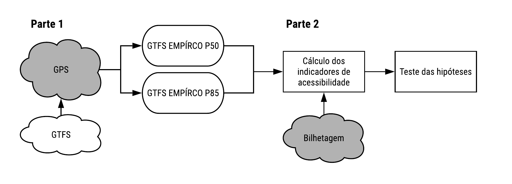
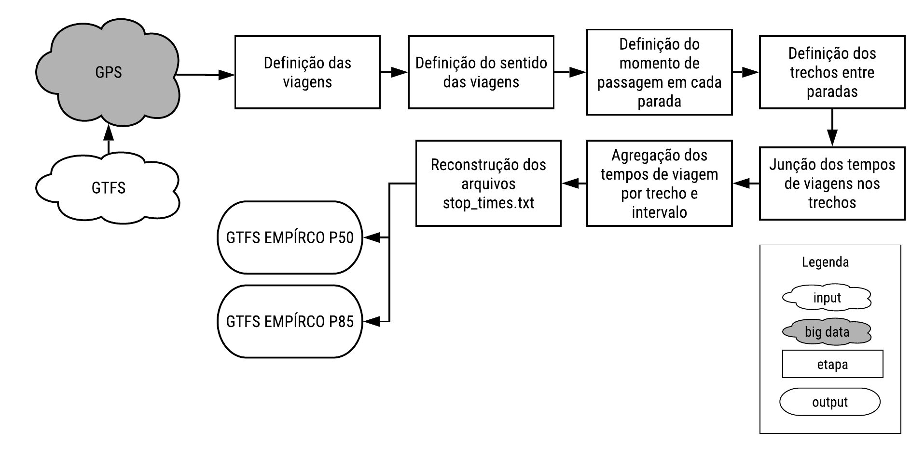
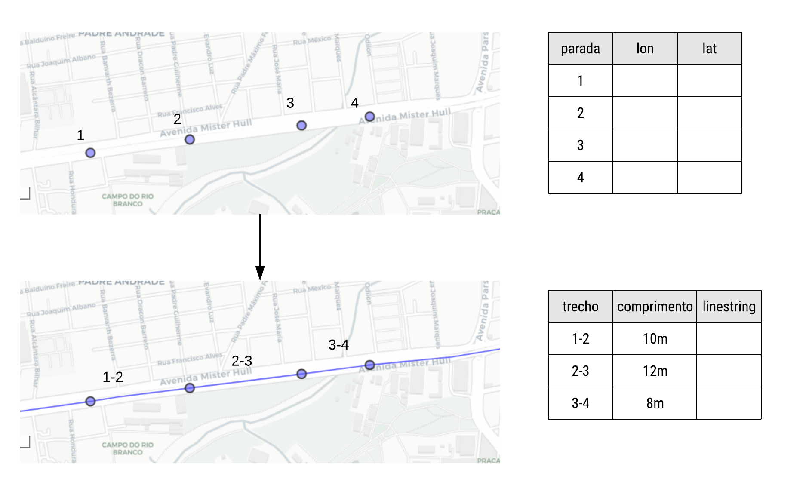
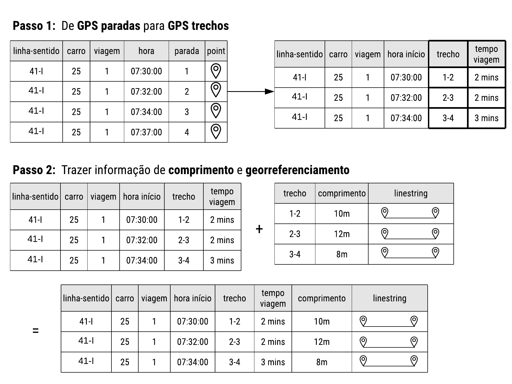
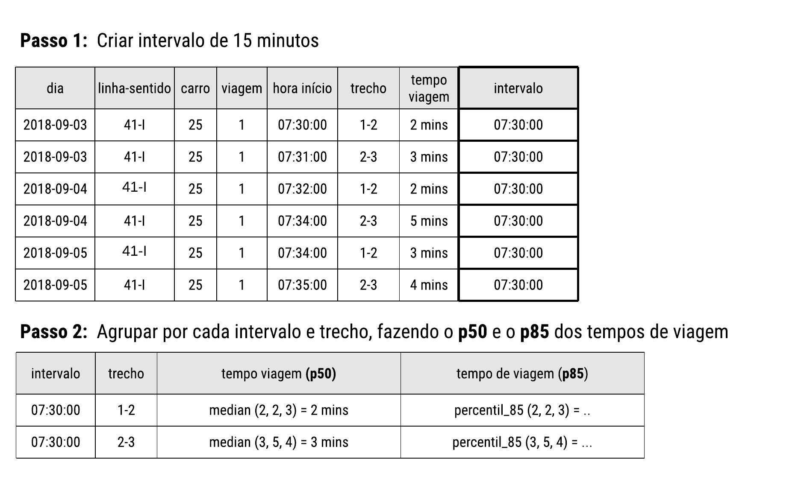
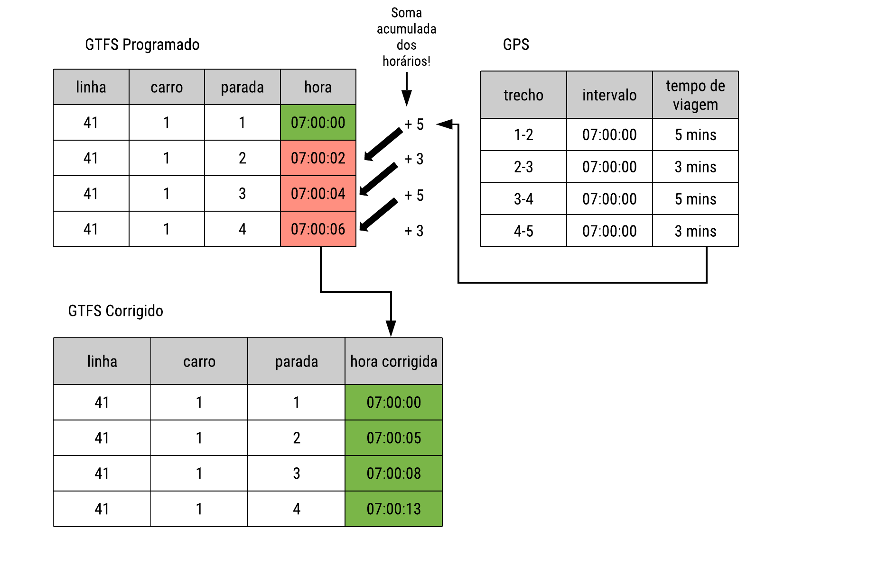
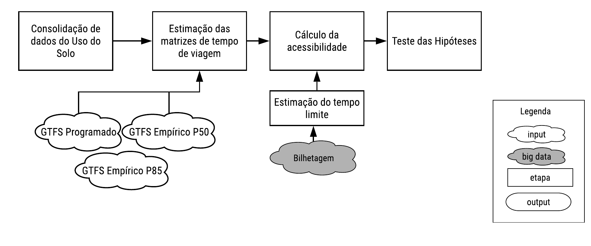
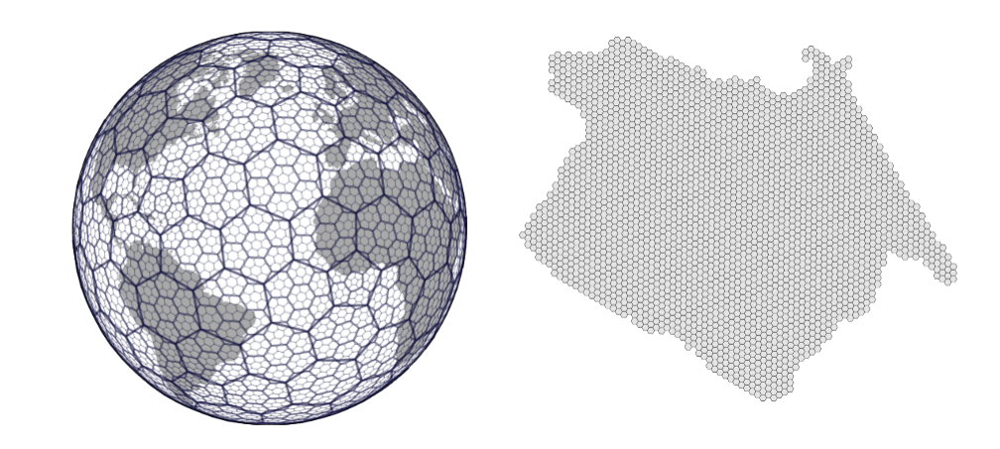
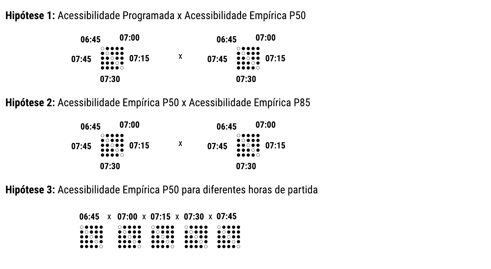

# Método para análise da variabilidade da acessibilidade por transporte público com o uso de *big data*


Esse capítulo busca estabelecer métodos para alcançar os três últimos objetivos do trabalho. Para isso, ele é dividido em duas etapas: a **integração entre GPS e GTFS** e a **análise comparativa da acessibilidade** (Figura \ref{fig:metodologia_geral}). 


``` {r metodologia_geral, fig.cap = "Metologia geral do trabalho"}


```


A primeira etapa busca suprir as lacunas de pesquisa identificadas no segundo objetivo do trabalho. Assim, é descrito o método que vai transformar dados consolidados de localização da frota em informações estruturadas de horários da oferta de transporte público análogo ao *stop_times.txt*. Esse método é desenvolvido tendo em vista as hipóteses apresentadas na introdução do trabalho.


A segunda etapa apresenta os métodos utilizados para alcançar os três últimos objetivos específicos. Nela, é descrita a abordagem utilizada para calcular os indicadores com os dados estimados na etapa anterior, mostrando a importância da utilização de dados empíricos de tempos de viagem e do estudo de valores de dispersão do nível de serviço no sistema na variabilidade da acessibilidade. Assim, é descrita a abordagem utilizada para testar as três hipóteses determinadas.

Por fim, as considerações finais apresentam limitações mais gerais do método e os principais desafios a serem enfrentados na sua aplicação.

## Reconstrução da tabela de horários programados do GTFS para diferentes cenários


Essa etapa utilizará os dados consolidados de GPS e de GTFS advindos do capítulo anterior. Esses dados apresentam dados de localização da frota para todos os dias úteis de setembro de 2018 (19 dias) e dados de GTFS da primeira semana do mesmo mês. A ETUFOR disponibiliza dados de GTFS para cada semana, onde pode haver alguma variabilidade em relação a horário ou rota das linhas. A Figura \ref{fig:metodologia_parte1} esquematiza o método.
  
``` {r metodologia_parte1, fig.cap = "Metologia para reconstrução dos horários programados"}


```


### Definição das viagens

Os dados consolidados de GPS receberam um filtro espacial onde somente os registros localizados dentro do itinerário da linha eram mantidos. O itinerário de cada linha foi dividido em três partes: uma parte representava o fim da linha, outra o começo e outra o trajeto comum. Quando a linha tinha como um extremo um terminal, o *shape* do terminal era determinado como sendo a parte do começo/fim. Quando o extremo não era um ponto de terminal, foi estabelecido um buffer de 50 metros como sendo a área de início/fim. Assim, para cada registro de localização, é identificado a linha a que está servindo e se aquele registro é na rota ou no começo/fim da viagem.

Com essa informação, o fim de uma viagem era determinado no primeiro registro de GPS dentro da área de começo/fim. O início da viagem seguinte, então, acontecia no último registro antes do veículo sair da área de início/fim de viagem. Esse método difere do de @Arbex2016 e @Rabay2017 porque permite considerar o tempo perdido de cada veículo com manobras/embarque/desembarque no fim/começo das suas viagens.

A principal limitação acontecia quando um veículo porventura passava muito rápido pelo ponto de fim da viagem e acabava registrando só um ponto de GPS dentro da área de começo/fim, o que impossibilitava determinar o fim e o começo de acordo com o método. Quando isso acontecia, esses pontos eram duplicados, e o fim da viagem e começo da próxima eram assumidos como o mesmo ponto.

### Definição de sentido da viagem

Para definir o sentido da viagem (ida ou volta), o método estabelecido não foge do que é feito na literatura. Primeiramente, os registros de cada viagem são ordenados pelo momento do registro. Então, é feito um *snap* de cada registro de GPS para a parada mais próxima de **ida** daquela linha, e essas paradas tinha uma identificação com a sequência que elas acontecem (*stop_sequence*). Por fim, era analisado: se os pontos de GPS daquela viagem estiverem indo no mesmo sentido da a sequência de paradas, a viagem estava indo no sentido da **ida**; senão, será viagem de **volta**.

### Definição do momento de passagem em cada parada e detecção de outliers {#momento-parada}

Por fim, para recompor a tabela de horário dos veículos, é necessário estimar o momento que cada veículo passou pelas paradas da sua correspondente linha e sentido. A abordagem aqui adotada leva em conta a distância acumulada percorrida pelos registros de GPS e a distância acumulada da posição das paradas, na linha em questão. A Figura \ref{fig:interpolacao} esquematiza o processo. Digamos que uma linha tenha o trajeto especificado abaixo. Primeiro, é feito o *snap* do ponto de GPS para a linha. Segundo, é garantido que o primeiro ponto de GPS e a primeira parada estejam no mesmo ponto. A partir desse ponto, então, são calculadas as distâncias acumuadas na linha tanto dos pontos de GPS (em baixo) como das paradas (em cima). Do lado dos dados de GPS, cada ponto agora tem a distância acumulada na rede e o momento do registro de localização. É então feita uma interpolação linear que interpola a hora em cada distância acumulada da parada.

  
``` {r interpolacao, fig.cap = "Interpolação do momento de passagem em cada parada"}


```
  

O processo de *snap* do ponto de GPS para a linha pode ser problemático. Pontos de GPS podem ter variações na sua localização, o que muitas vezes pode fazer o ponto ser alocado para o trecho errado da linha. O caso mais clássico é quando uma linha, numa viagem do mesmo sentido, percorre trechos de uma mesma avenida, só que no sentido contrário. Isso, somado à imprecisão do GPS, leva certos pontos a serem alocados para o sentido errado da via naquele momento. Para contornar isso, pontos outliers são detectados e removidos.

Acredita-se que essa metodologia representa uma avanço em relação às abordagens encontradas. @Arbex2016, contando com registros de GPS a cada 30 segundos, realiza um *snap* para saber qual o registro está mais pŕoximo de cada parada, então assumindo esse registro como a hora de passagem caso ele esteja a no máximo 200 metros de distância da parada. @Wessel2017 contam com uma amostragem maior de registros de GPS (10 segundos), então os autores fazem um *buffer* de 20 metros em relação a cada parada e interceptam o registro que caia dentro daquela área. Os autores só aplicam técnicas de interpolação caso não seja possível estimar a hora de passagem em uma parada.
 
Com os dados de GPS com informações consolidadas de linha, viagem, sentido e passagem em cada parada, e tendo em vista as limitações e hipóteses estabelecidas, é proposta uma agregação desses tempos de viagem por cada trecho.

### Definição dos trechos entre paradas

A proposta é fazer uma agregação espacial dos tempos de viagem coletados na etapa anterior, sendo isso feito utilizando o trecho que o veículo percorreu. Trecho é aqui definido como qualquer segmento entre paradas seguidas em que algum veículo de algum linha esteja programado para trafegar no SIT-FOR. A criação dos trechos começa na coleta, a partir dos dados de horários programados *stop_times.txt*, dos trechos em que todos os veículo do sistema esteja programado para rodar. Essa informação mostra todos os trechos possíveis e os pontos de começo e fim de cada um deles. Para recompor mais detalhadamente os trechos, é feito o uso do arquivo *shapes.txt*, que apresenta pontos de cada uma das linhas com uma maior resolução espacial. Por fim, o arquivo final apresenta todos os trechos possíveis com a informação do comprimento total e da geolocalização na forma de uma *linestring* (Figura \ref{fig:trecho_paradas}).

  
``` {r trecho_paradas, fig.cap = "Criação dos trechos entre paradas"}


```
  

### Junção dos dados de GPS para os trechos entre paradas

Os dados de GPS resultantes da seção \ref{momento-parada} apresentam uma estrutura semelhante aos dados de viagens agendadas do GTFS, com o registro da hora em que cada veículo passou em cada parada daquela linha. Buscando saber o tempo de viagem de cada trecho de viagem realizado por cada veículo, é feita a junção dos dados de GPS para os trechos de paradas. O primeiro passo transforma os dados de GPS de uma estrutura de paradas para uma estrutura de trechos (Figura \ref{fig:gps_para_trechos}, Passo 1). O segundo passo, por fim, trás as informações disponibilizadas na etapa anterior de comprimento e localização do trecho (Figura \ref{fig:gps_para_trechos}, Passo 2). Esse tipo de informação não é utilizada na recomposição dos horários dos veículos, mas é importante para testar a qualidade da amostra futuramente. A base resultante apresenta as informações do tempo de viagem de cada veículo de cada linha a cada trecho percorrido, com a consequente informação do comprimento do trecho.

``` {r gps_para_trechos, fig.cap = "GPS paradas para trechos"}


```
  

### Agrupamento dos tempos de viagem nos trechos e intervalo de 15 minutos

Ao contrário dos trabalhos já realizados que utilizaram dados de GPS para a reconstrução do arquivo de GTFS [@Wessel2017], aqui é adotada uma metodologia de agregar os tempos de viagens nos trechos estimados a cada 15 minutos. Isso foi feito por duas razões: 1) não foi possível estimar os tempos de viagens entre as paradas de todos os veículos do SIT-FOR, então não é possível recompor a oferta completa do sistema só pelos dados de GPS e 2) a agregação permite estimar para cada trecho tempos de viagem medianos e de 85º percentil, o que possibilita reconstruir dois arquivos *stop_times* para estudar a variabilidade da acessibilidade em função da dispersão do tempo de viagem nos trechos, verificando a segunda hipótese. 

A base final da etapa anterior tem, para todos os dias úteis do mês de setembro/2018, informações de tempo de viagens em cada um dos trechos que foram captados a partir das informações do GPS, com o registro do momento exato em que cada veículo passou pelo trecho que era previsto. Buscando agrupar as informações para cada trecho de parada do sistema, primeiramente o momento de passagem de cada veículo por cada trecho é aproximado para o intervalo de 15 minutos mais próximo (etapa 1 da Figura \ref{fig:agregar_tempos_trechos}). Em seguida, para todas as viagens realizadas por todas as linhas, é feito um agrupamento desses tempos de viagem por trecho e intervalo para duas medidas: a mediana (P50) e o 85º percentil (P85) da distribuição do tempo de viagem (etapa 2 da Figura \ref{fig:agregar_tempos_trechos}).  Assim, é criada uma base de dados com duas colunas de tempo de viagem: uma representando o tempo de viagem em todos os trechos (em cada intervalo de 15 minutos) para uma situação mediana, e outra representando uma medida de dispersão (no que diz respeito ao tempo de viagem) do sistema.


``` {r agregar_tempos_trechos, fig.cap = "Agregação dos tempos de viagens nos trechos"}


```
  

O tamanho da amostra de tempo de viagem de cada trecho vai depender da quantidade de linhas que passam por ali (trechos em avenidas troncais tendem a ter uma amostra bem maior do que trechos em ruas locais) e do intervalo em questão (horário de pico tende a ter uma frequência maior de ônibus). Dessa forma, os percentis 50 e 85 tendem a ser mais confiáveis em trechos com uma amostra maior, e é importante que assim o seja: esses trechos pertencem a avenidas que apresentam níveis maiores de congestionamento. Para trechos mais locais, por conta da menor amostra, os percentis tendem a ser menos significativos, mas a própria variação do tempo de viagem tende a ser menor, então isso tende a ser suavizado.


Observações de tempo de viagem de um trecho que ficaram de fora do valor de 1.5 * IQR (*Inter Quartile Range*, ou o intervalo entre quartis 0.25 e 0.75) foram excluídas, entendendo que poderiam representar um estado atípico do sistema, como acidentes, chuva, problemas mecânicos do veículo etc. Para garantir que o trecho tenha uma amostra de tempo de viagem significativa, trechos que tiveram menos que 10 observações são excluídos. Além disso, trechos com coeficiente de variação (divisão da média pelo desvio padrão) do tempo de viagem maior que 100% também são excluídos.


É entendido que dentro de um mesmo intervalo de 15 minutos pode acontecer uma flutuação natural do tempo de viagem nos trechos do sistema. Por exemplo, é esperado que em certo trechos o tempo de viagem de um veículo que passa às 06:23 e outro que passa às 06:37 tenha uma variação natural, e estes tempos de viagem são agregados para o mesmo intervalo de 06:30. A utilização do percentil 85 busca então identificar tempos de viagem que ao mesmo tempo não sejam tão extremos (como no caso do uso de percentil acima do 90) e que não façam parte da variação natural do serviço dentro do intervalo. Também é importante frisar que a agregação de dias úteis de um mês de dados assume que tempos de viagens tem pouca variação entre dias da semana ou entre semanas desse mês específico. 


A utilização do percentil 85 para os tempos de viagem também vai de encontro à distribuição da variável. Apesar de não ser assumido aqui que os tempos de viagem em cada trecho têm uma distribuição normal, o percentil 85 é utilizado porque aproximadamente representa o valor de 1 desvio padrão em relação à média da distribuição.


A abordagem de agregar os tempos de viagem nos trechos para dois percentis é diferente do que foi feito nos trabalhos de @Wessel2017 e @Arbex2016a. No primeiro, a abordagem foi bem diferente: os autores calcularam o tempo de viagem para dois dias e os usaram como eles acontecem para reconstruir o *stop_times* e para calcular o indicador de acessibilidade, então fazendo a média dos dois valores do indicador calculado (amostra n = 2). Essa abordagem, portanto, só leva em consideração o estado do sistema em especificamente dois dias. No último, é mencionado que foram coletados 20 dias de tempos de viagem, porém não é mencionado como essa amostra foi utilizada para recompor um arquivo único *stop_times*.


### Reconstrução dos arquivos *stop_times* do GTFS


O método, então, resumidamente busca substituir os tempos de viagem entre paradas que foram programados com tempos de viagem empíricos, para intervalos de 15 minutos iguais, depois somando-os cumulativamente. Essa abordagem traz alguns desafios. Uma tabela de horários de um sistema de transporte público de média-alta complexidade é mais que somente a soma dos tempos que os veículos percorreram ao longo da sua rota. Então, foi necessário investigar diversos pormenores que estavam presentes na tabela. Após inspeção visual e consulta com gestores do sistema, foram levantadas e confirmadas algumas hipóteses:


* Cada operador de um veículo (motorista e/ou cobrador) tem direito a um descanso entre 30 e 59 minutos a cada 2 horas de trabalho, em média. Esses descansos estão previstos na tabela de horários;
* Outras pausas mais longas, entre 1h e 2h, também estão previstas;
* Veículos que estão adiantados em relação ao programado fazem pausas mais longas e começam a viagem seguinte no horário programado.


Tendo essas informações em mente, foi necessário estabelecer duas premissas para a reconstrução: 1) o horário da primeira partida de cada veículo é correto e 2) a oferta (quantidade de veículo rodantes) é correta. De acordo com os gestores do sistema e com os dados que foram apresentados, essas premissas são factíveis, principalmente porque o repasse dos recursos para as empresas operadoras do sistema depende da pontualidade da primeira viagem e da quilometragem rodada (em relação à prevista) de cada linha.


A Figura \ref{fig:reconstrucao_gtfs} esquematiza o método desenvolvido para reconstruir o arquivo com os horários programados. A primeira tabela à esquerda apresenta a tabela dos horários agendados de um carro de uma linha 41, nas primeiras 4 paradas. Na direta, tem-se a tabela agregada do GPS com o tempo de viagem mediano (só para demonstração) de todos os carros que passaram em cada um dos trechos determinados, no intervalo de 07:00:00 (valores são agregado para o intervalo de 15 minutos mais próximo, como explicado na metodologia). Confirmado que os intervalos da hora programada e do GPS são condizentes, é assumido então que o horário da primeira partida do carro é o horário correto (em verde). Dessa forma, para cada trecho de viagem correspondente, é feita a soma acumulada dos tempos de viagens a partir do primeiro horário, resultando na tabela (na parte inferior) com o horário acumulado corrigido.

``` {r reconstrucao_gtfs, fig.cap = "Reconstrução do arquivo stoptimes"}


```


A soma acumulada dos horários corrigidos é feita até o fim de cada viagem. Ao chegar o fim, outra medida estimada a partir dos dados de GPS é utilizada: o **tempo entre viagens**. Para cada linha, para o intervalo de 30 minutos mais próximo, é estimado o tempo entre uma viagem e outra (com a distinção se é uma transição entre **ida** e **volta** ou **volta** e **ida**). Isso é importante principalmente para linhas que utilizam terminais de integração, onde o tempo decorrido desde as manobras até o desembarque e o embarque dos passageiros pode levar minutos, e esse tempo de atraso não é explicitamente incorporado no *stop_times* programado. Digamos que, então, na tabela programada, um veículo da linha 41 chegou no fim da sua viagem de **ida** às 07:10. É buscando então na base empírica a **mediana** do tempo que todos os veículos da linha 41 levaram entre a viagem de **ida** e a de **volta** no intervalo de 07:00.


Essa correção do tempo entre viagens é feita até que seja encontrado um intervalo entre viagens programadas entre 30 e 59 minutos. Como identificado, isso representa uma pausa para os funcionários do veículo, e é respeitada. Então, quando for encontrada uma pausa entre viagens, o valor desse intervalo é incorporado e somado à hora corrigida.


Como previsto, há ainda um outro tipo de pausa entre 1h e 2h, porém sendo bem mais rara que a pausa mais curta. Quando é identificado esse tipo de intervalo no serviço, o horário de saída corrigido para a viagem após a pausa é o mesmo horário programado, independente de atraso ou adiantamento.


Esse passo a passo detalhado nos últimos parágrafos é feito para cada veículo na tabela de horários programados do *stop_times*, tanto para a mediana como para o percentil 85 do tempo de viagem em cada trecho. Como o objetivo é estimar indicadores para a hora de pico da manhã, somente as viagens realizadas no sistema que começaram até as 9 da manhã foram corrigidas. Esse filtro, além de não comprometer a futura estimação dos tempos de viagem entre pares origem-destino, reduz a complexidade de problemas que podem acontecer caso a correção fosse feita para o dia todo. Além disso, torna os processos computacionalmente mais ágeis.


O produto final, por fim, são dois arquivos de GTFS: um possuindo uma tabela de horários *stop_times.txt* para os tempos de viagem P50 e outra com a tabela *stop_times.txt* para o tempos de viagem P85. Esses GTFS serão chamados de empíricos a partir daqui, com o GTFS Empírico P50 sendo também chamado de GTFS Corrigido, fazendo uma contrapartida ao GTFS Programado.

Alguns limitações importantes do método devem ser ressaltadas. O método, ao recompor cada viagem baseado em tempos de viagem entre trechos que são advindos de uma distribuição de vários dias e situações, deixa de incorporar algumas situações causais reais que são observadas. Por exemplo: o comportamento do motorista pode mudar conforme o seu desempenho na aderência à tabela programada. Se ele percebe que está atrasado, pode dirigir mais rápido ou pular algumas paradas na tentativa de adequar o veículo ao horário. Se ele chega ao fim da linha atrasado e tem direito a um descanso, ele pode diminuir o tempo do seu descanso para partir no horário programado na próxima viagem (esse comportamento, entretanto, de acordo com os operadores do sistema, é raro de acontecer: o tempo de pausa dos motoristas é considerado “sagrado”).  Além disso, o método não incorpora ajustes nos horários dos ônibus que podem ser feitos em tempo real a partir dos atrasos/adiantamentos que estão acontecendo. Por exemplo: os veículos estão tão atrasados que o operador colocou um veículo extra, ou antecipou a saída de outros veículos.

Os principais produtos dessa etapa (GTFS Empírico P50 e GTFS Empírico P85) são levados junto com o GTFS Programado para a próxima etapa, que trata da análise comparativa da acessibilidade com os teste de algumas hipóteses.

## Análise comparativa da acessibilidade

A Figura \ref{fig:metodologia_parte2} esquematiza o método utilizado para fazer as análises comparativas de acessibilidade. Para mostrar a importância dos métodos estabelecidos acima, serão calculados indicadores de acessibilidade para as atividades de emprego e educação.

``` {r metodologia_parte2, fig.cap = "Metodologia da análise comparativa das hipóteses"}


```


### Consolidação de dados do uso do solo e agregação espacial

É necessário consolidar dados de empregos e educação para o cálculo dos indicadores de acessibilidade para essas atividades. Dados de empregos são advindos da Relação Anual de Informações Sociais (RAIS) (Ministério do Trabalho), do ano de 2017, que detém dados de vínculos formais no Brasil.

Os dados da RAIS disponibilizados junto ao IPEA (Instituto de Pesquisa Econômica Aplicada) apresentam um pré-tratamento que busca eliminar outliers que possam indicar uma concentração indevida de empregos em certos locais. É conhecido que, na base da RAIS, a localização da maioria dos serviços públicos é concentradas em endereços que representam a categoria do serviço. Por exemplo, a maioria dos profissionais de educação do estado são concentrados no endereço da secretaria de educação do estado.

Dados de educação são do Censo Escolar de 2015, que apresenta diversas informações sobre cada escola no Brasil, como sua localização, se é público ou privada, e a quantidade de matrículas em cada segmento do ensino (ensino infantil, ensino fundamental e ensino médio). Para esse trabalho, serão consideradas as matrículas para ensino infantil, fundamental e médio de todas as escolas públicas (municipais, estaduais e federais) de Fortaleza.

### Estimação das matrizes de tempo de viagem

A estimação das matrizes busca subsidiar o cálculo de indicadores de acessibilidade que serão utilizados para avaliar três hipóteses levantadas como integrantes das questões de pesquisas nesse trabalho: 1) há um diferença entre a acessibilidade estimada pelas tabela de horários programados e a estimada pela tabela de horários empíricos, e 2) há uma diferença entre a acessibilidade estimada para tempos de viagem entre paradas medianos (GTFS Empírico P50) e a estimada para tempos de viagem entre paradas extremos (GTFS Empírico P85) e 3) há uma diferença de acessibilidade entre os horários de partida. Essa última hipótese já foi bastante discutida na literatura, [@Stepniak2019; @Owen2015]. Isso acontece porque, para viagens de transporte público, até pequenas diferenças no horário do começo da viagem (domicílio) podem implicar em grande diferenças no tempo total de viagem, principalmente através da perda de integrações e elevados tempos de espera [@Stepniak2019]

Para mostrar a importância da utilização dos tempos de viagens empíricos para análises de acessibilidade, é feita a estimação do tempo de viagem entre pares origem-destino. Para esse fim, são utilizadas as agregações espaciais H3 desenvolvidas pelo Uber (Figura \ref{fig:uber_h3}). A agregação escolhida é um hexágono que tem tamanho de diagonal menor igual a 357 metros, o que possibilita analisar de forma desagregada a variação da acessibilidade. Já foi mostrado que esse tipo de agregação é capaz de mostrar algumas tendências de acessibilidade (como acessibilidade maior perto de corredores de média/alta capacidade) que outras agregações maiores não conseguem [@Pereira2019].

``` {r uber_h3, fig.cap = "Agregações hexagonais H3"}


```
  
Portanto, para a avaliação da hipótese 1, serão estimadas 5 matrizes de tempo de viagem entre cada um dos pares origem destino de Fortaleza entre 6h45 e 7h45 da manhã, uma cada 15 minutos, para o GTFS Programado e para o GTFS Empírico P50. Para a hipótese 2, serão estimadas mais 5 matrizes de tempo de viagem a cada 15 minutos entre entre 6h45 e 7h45 da manhã para o GTFS Empírico P85. No total, serão estimada 8 matrizes para a hipótese 1 e mais 4 para a hipótese 2.

Para a estimação do tempo de viagem, foi escolhido o *OpenTripPlanner*. A sua escolha foi feita por algumas razões: 1) é um aplicativo completamente gratuito, open source e sem limitação de uso; 2) integra facilmente com as demais ferramentas utilizadas nesse trabalho (principalmente o R); 3) é de uso constante do autor há alguns meses. A ferramenta considera todas as etapas do deslocamento no seu roteamento: o tempo de caminhada até a parada, o tempo de espera, o tempo no veículo e o tempo de espera em possíveis integrações. 

Atualmente, a utilização do OTP em massa pode ser feita de duas formas (principais): 1) através de consultas feitas a um servidor local e 2) através de um API que liga o Java diretamente ao Python. A primeira forma é capaz de retornar como resultado um passo a passo completo do itinerário para o par origem-destino escolhido, com os tempos de espera, caminhada, dentro do veículo, e a linha de cada etapa por transporte público. A segunda forma retorna informações somente de tempo total de viagem e distância de caminhada, porém apresenta uma velocidade de processamento que pode chegar até 20x mais rápida que a primeira alternativa. 

A utilização dos hexágonos de diagonal menor de 357 metros resulta em 2760 hexágonos para a cidade de Fortaleza, sendo o roteamento feito a partir do centróide de cada hexágono. Isso implica num total de 7,7 milhões de pares origem-destino, e para 12 consultas em hora pico isso resulta em mais de 92 milhões de consultas de tempo de viagem. Tendo em vista esse volume, a segunda opção foi selecionada como sendo a mais viável.

O OTP permite que sejam determinados alguns parâmetros para o seu roteamento. Dentre eles, o principal é o da distância máxima de caminhada, que para esse trabalho foi estabelecida como 800 metros. Essa distância, entretanto, não é respeitada caso a única alternativa para o usuário seja uma caminhada maior que o limite.

Para tornar o roteamento mais eficiente, hexágonos que não tiveram nenhuma população ou atividade serão excluídas da análise, sendo entendido que estas não serão origem ou destino para nenhuma atividade.

Com as matrizes de tempo de viagem estimadas, é passado para etapa que vai calcular os indicadores de acessibilidade.

### Cálculo da acessibilidade

O indicador escolhido para testar as hipóteses do trabalho é o indicador de acessibilidade cumulativa. Esse indicador, de fácil compreensão, estima a quantidade de oportunidades que podem ser alcançadas dado um certo tempo de viagem limite. Esse indicador foi utilizado em vários dos trabalhos citados neste texto [@Wessel2017; @Owen2015; @Pereira2019].

De acordo com a classificação estabelecida por @Geurs2004, essa medida consegue incorporar os componentes de transporte e uso do solo, e o seu cálculo para diferentes horários de partida na hora pico também incorpora o componente temporal.

Como limitação, o indicador aqui utilizado assume que todas as oportunidades são igualmente desejáveis pelos viajantes. É assumido que uma escola a 1km da sua casa tem o mesmo peso que uma escola a 5km, por exemplo. Além disso, não incorpora a competição que há por essas atividades.

Portanto, são calculados indicadores de acessibilidade cumulativa para duas atividades: trabalho e educação. As atividades de trabalho são representadas pela quantidade de vínculos empregatícios ativos coletados da RAIS, enquanto que as atividades de educação são representadas pela quantidade de matrículas de ensino infantil, médio e fundamental somados.

Como dito, é necessário o estabelecimento de um tempo limite de viagem para o cálculo desse indicador. A abordagem tradicional estipula esse tempo muitas vezes baseado no que ele deveria ser, e não no que realmente acontece no sistema. É proposto então o uso dos dados de bilhetagem para esse fim.

### Estimação do tempo limite

Indicadores cumulativos precisam de uma informação de tempo limite para sua estimação. A abordagem predominante na literatura assume tempos limites que variam entre 30 e 90 minutos. A metodologia escolhida aqui parte para a estimação de um indicador positivo, onde serão utilizadas as informações de viagens realizadas pelos usuários advindas dos dados de bilhetagem. 

Será, então, calculado o tempo de viagem para cada viagem que foi realizada em hora pico para os motivos de trabalho (viagens realizadas com vale transporte) e para motivo de educação (viagens realizadas por carteira de estudante). Foi escolhido o dia 12 de setembro de 2019 como um dia típico, que está dentro do intervalo de dados que já foi consolidado.

Os dados consolidados de bilhetagem apresentaram uma falha da localização de parte das suas validações. Por isso, a primeira etapa do método consiste em deletar os usuários que tiveram pelo menos uma validação não localizada em seu diário. Em seguida, são filtradas somente as validações por vale transporte e por carteira de estudante.

Como determinado na metodologia, os dados utilizados de educação serão do censo escolar, que só englobam escolas de ensino infantil, fundamental ou médio. Os dados de bilhetagem para carteira de estudante, entretanto, apresentam informações de viagens de todos os usuários, incluindo usuários que acessam oportunidades de educação do ensino superior. Para corrigir isso, foi feita uma consulta à base de registros dos usuários do bilhete único, filtrando somente os usuários de carteira de estudante que nasceram após o ano 2000, que aproximadamente representaria estudantes até o fim do ensino médio. Esses usuários então foram filtrados na base da bilhetagem. Como foi visto na parte da consolidação, há uma falta de correspondência entre as bases da bilhetagem e do cadastro único, então esse tipo de integração acabará diminuindo o tamanho da amostra disponível.

Para a estimação dos tempos de viagem, então, são filtrados aqueles usuários que realizaram a primeira viagem no período do pico da manhã (antes das 8h), que viajaram pelo menos duas vezes e que tiveram um tempo mínimo de 3h entre validações. Esse último critério busca estabelecer um tempo mínimo para cada atividade e excluir validações de integração.

Garantidas essas condições, é então estabelecido que a localização da primeira viagem é a **origem** e que a localização da viagem seguinte é o **destino** do usuário. Isso representa uma aproximação que traz consigo a premissa de que o usuário não realizou nenhum trecho que não fosse por transporte público e a pé entre essas duas viagens. Essa é uma limitação que já foi abordada e contornada bastante na literatura [@Trepanier2007; @Munizaga2012] com a consolidação do Trip Chaining Method. Para este trabalho, entretanto,  é mantida.

Com as origem e destinos determinadas e localizadas, é feita uma associação espacial com os hexágonos escolhidos nas etapas anterior. Com as matrizes de tempo de viagem já estimadas, é então sabido o tempo de viagem entre cada uma das origens e destinos obtidos. Para isso, é utilizada a matriz de tempo de viagem a partir do GTFS Corrigido.

Isso então oferece o tempo de viagem do pico manhã para cada um dos usuários que se encaixou nos critérios estabelecidos. Determina-se então que o tempo limite é o **percentil 75** do tempo de viagem para cada um dos motivos de viagem (trabalho e educação). Isso é feito entendendo que esse tempo tende a ser diferente para as atividades. 

### Teste das hipóteses

Por fim, é feita uma análise comparativa para avaliar as três hipóteses definidas neste trabalho. O teste das hipóteses é feito de forma descritiva, analisando valores absolutos e relativos de variação. A Figura \ref{fig:metologia_teste_hip} ilustra as hipóteses e qual indicador vai ser avaliado. É importante ressaltar que o GTFS Empírico P50 é aqui considerado como o que representa o estado mediano do sistema. Ele é o que representa o valor “corrigido” do GTFS Programado. Também é utilizado o termo “cenário” para identificar cada lado de uma hipótese.

``` {r metologia_teste_hip, fig.cap = "Hipóteses a serem testadas"}


```
  
Primeiramente, para avaliar a diferença entre a acessibilidade pelo GTFS Programado e o GTFS Corrigido, é feita uma comparação não-espacial dos valores de acessibilidade estimados para todos os hexágonos para o caso do GTFS Programado e do GTFS Corrigido, para as atividades de trabalho e educação. Como para ambos os GTFS foram calculadas matrizes para 5 tempos de partida, os indicadores são calculados em torno de uma matriz da mediana do tempo de viagem (n = 5). 

Em seguida, a diferença relativa entre os dois indicadores é mostrada no mapa. Como a variação da acessibilidade pode ser negativa ou positiva, o indicador escolhido será a divisão do logaritmo da acessibilidade corrigida pelo logaritmo da acessibilidade programada.

Para a diferença absoluta, é também analisada a distribuição espacial e não-espacial do indicador. Para fazer uma comparação entre as atividades, a distribuição não-espacial é analisada através da porcentagem da diferença absoluta em relação ao total de atividades na cidade. Por exemplo, hipoteticamente falando, será mostrado que certo hexágono perde 10% do total de empregos da cidade ou 5% do total de matrículas quando é utilizado o GTFS Programado em vez do GTFS Corrigido. Esse indicador resumidamente responde à pergunta "qual a proporção de empregos/matrículos da cidade que não são mais acessíveis?"

Para a hipótese 2, é feita uma comparação de como a acessibilidade varia levando em conta os diferentes cenários de variabilidade de tempo de viagem. Primeiramente, é feita uma comparação visual dos mapas da acessibilidade para tempos medianos (GTFS Empírico P50) e para tempos de dispersão (GTFS Empírico P85). Em seguida, é analisada a variação absoluta da acessibilidade. Mais uma vez, os indicadores são calculados em torno de uma matriz da mediana dos tempos de viagem (n = 5) para as atividades de emprego e educação. Similar à análise feita na hipótese 1, a diferença absoluta também será analisada como o percentual em relação ao total de atividades na cidade.

Para essas duas hipótese também é feita uma análise da área de influência de algumas agregações críticas de acessibilidade. São selecionados hexágonos que estejam em áreas de média/alta densidade e que tenha uma grande variabilidade de acessibilidade entre os cenários. A área de influência é representada pelos hexágonos que cada um dos hexágonos críticos conseguem alcançar.

Por fim, é feita uma análise de como a acessibilidade pode variar para diferentes horários de partida, dentro da hora pico. Para isso, será utilizado o coeficiente de variação da acessibilidade (P50) da amostra coletada de tempo de saída (06:45 à 07:45, cada 15 minutos). O indicador no mapa permite ver onde o impacto do tempo de partida é maior, com a limitação principal sendo do tamanho pequeno da amostra (n = 5 horários de partidas). 

O tamanho da amostra de coleta dos tempos de viagem pode ser considerada a principal limitação dessa metodologia de avaliação das hipóteses. Em virtude do alto tempo de processamento na produção das matrizes, foi identificado um *tradeoff* entre a resolução espacial e temporal. Neste trabalho, foi escolhida a resolução espacial como prioridade, principalmente em virtude do que é feito na literatura: enquanto resoluções temporais maiores já foram exploradas, pouco foi feito utilizando uma resolução espacial maior. A resolução espacial maior permite, por exemplo, identificar como a acessibilidade é maior perto de corredores de transporte público, e como a variação dela também é menor nessas áreas. 


O método para testar as hipóteses baseia-se na comparação visual e de medidas descritivas como mediana, percentis e coeficiente de variação. Entende-se, entretanto, que essa análise apresenta limitações, visto principalmente que estamos tratando de um fenômeno que tem conhecido caráter de dependência espacial.

## Considerações finais

É importante ressaltar que a estimação dos tempos de viagem entre pares origem destino pode falhar na captação de algumas peculiaridades culturais e sistemáticas de um sistema de transporte público. Em Fortaleza, por exemplo, a consolidação de 7 grandes terminais de integração tornaram esses pontos quase como paradas obrigatórias na integração das viagens dos usuários. A oferta do sistema em si, construído numa configuração tronco-alimentadora, já leva os usuários a fazerem a integração no terminal. Soma-se isso à sensação de segurança e conforto proporcionada pelos terminais, levando à uma grande utilização dos mesmos, mesmo que isso represente um acréscimo no tempo de viagem do usuário. No roteamento do OTP, entretanto, os terminais são considerados pontos de parada como todos os outros, e a rota retornada sempre será aquele de menor desutilidade, que, no caso, é a de menor tempo.

Outra limitação importante é a não incorporação das linhas de média/alta capacidade. Isso deu ao fato dessas linhas ainda não serem integradas ao sistema, nem tarifariamente e nem operacionalmente. Além disso, a frequência dessas linhas é bem baixa, o que pode comprometer a sua qualificação como “alta capacidade”. A Linha Sul, que vai da região metropolitana ao centro da cidade, tem intervalo maiores que 15 minutos. A Linha Oeste, que tem características parecidas, tem intervalo maior que 30 minutos. O novo VLT ainda está em processo de implementação, funcionando em operação assistida só em hora pico. 

A implementação da metodologia proposta traz alguns desafios, sendo o principal de ordem computacional. O processamento dos dados de GPS (já separados por dia) pode ser feito em um computador pessoal, mas etapas como a agregação dos tempos de viagens de todos os dias e a estimação das matrizes de tempo de viagem entre pares origem-destino requer máquinas de médio/alto poder de processamento para uma geração de resultados em um tempo razoável. Esse alto tempo de processamento somado ao cronograma limitado de uma pesquisa de mestrado levou à tomada de decisões que impuseram limites à metodologia do trabalho, como destacado acima no *tradeoff* entre a resolução espacial e a resolução temporal da análise. A implementação da metodologia acontece no próximo capítulo.