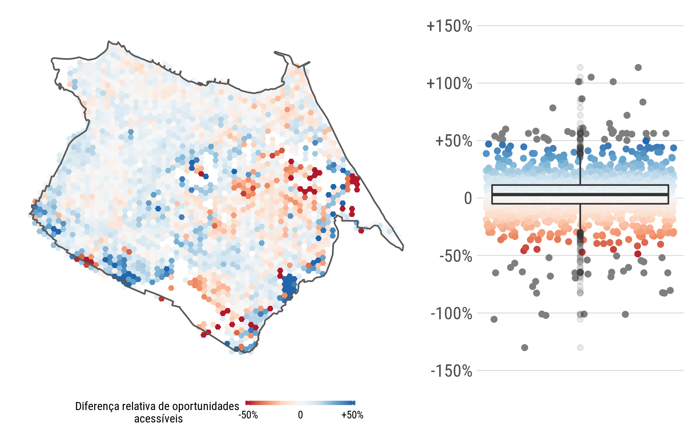

# Discussão dos resultados

Este capítulo busca alcançar os três últimos objetivos do trabalho, mostrando os principais resultados advindos da aplicação do método do capítulo anterior e a importância do mesmo. Os resultados são apresentados e as hipóteses são discutidas individualmente, analisando o impacto da variabilidade da acessibilidade na avaliação de políticas públicas. Por fim, é feita uma discussão geral dos resultados com a análise de como os resultados encontrados nesse capítulo se diferem dos encontrados na literatura.


## Reconstrução da tabela de horários programados do GTFS para diferentes cenários


O método do capítulo anterior é então aplicado para 19 dias úteis de setembro/2018 de dados consolidados de GPS, bilhetagem, GTFS e registros dos usuários. Os tópicos abaixo apresentam os principais resultados da aplicação


### Definição do momento de passagem em cada parada e detecção de outliers


A Figura \ref{fig:outliers_interp} mostra um caso onde é provada a aplicação do método para excluir outliers. O eixo x mostra a distância acumulada ao longo do trajeto, com o eixo y mostrando ao momento. O exemplo é de um veículo da linha 86, no sentido da ida. Observa-se, no gráfico de cima, alguns pontos de destoam dos demais. Essa linha tem a peculiaridade de passar na mesma via, em sentido oposto, em momentos diferentes. Como os pontos de GPS podem ser imprecisos no seu registro, alguns tempos que deveriam ter sido alocados a um sentido da via foram a alocados ao sentido oposto, causando os outliers mostrados na figura. O gráfico de baixo mostra a viagem sem os outliers, já com as paradas da linha que foram interpoladas linearmente.


``` {r outliers_interp, fig.cap = "Exemplo de interpolação das paradas e remoção dos outliers"}


```
  

De acordo com os dados de GTFS, o SIT-FOR apresenta 5713 trechos percorridos por veículos (sem contar com trechos percorridos por linhas corujões e expressos). Desse total, cerca de 330 trechos não tiveram tempo de viagem estimado. A principal razão para esse número é a falta de dados de tempo de viagem para linhas complementares, que funcionam principalmente no sistema alimentador onde são as únicas linhas trafegando por certos trechos. Segundo, algumas linhas comuns (não-expressas) rodam veículos em caráter expresso, especialmente em hora de pico. Esse tipo de trecho (um trecho só que corresponde a toda a viagem) não foi incorporado no método para calcular o tempo de viagem.


Foi estabelecido que a velocidade máxima aceitável em um trecho entre paradas é de 60 km/h, sendo descartado tudo que está acima desse valor. Aplicado esse critério, 0,8% da base foi descartada, porque:


* Havia alguns trechos com deserto de registro de localização do veículo. Isso pode acontecer por dois motivos: devido a um erro do aparelho de GPS ou devido à algum momento em que o veículo tenha saído da sua rota original. Foi então interpolado linearmente nas paradas, o que pode acabar penalizando trechos que tem mais baixa velocidade que outros, ocasionando altas velocidades em alguns deles;
* Algumas linhas (no mesmo sentido) apresentam trechos que correm muito próximos um dos outros, principalmente em situações em que a linha faz um retorno, voltando para a mesma via, só que em sentido contrário. Juntando isso à imprecisão nos registros de GPS, aconteceram casos em que o registro de localização foi alocado para o lado errado da via, causando uma imprecisão na estimação do tempo de passagem nas paradas;
* Algumas linhas podem operar em um itinerário diferente do previsto. Quando isso acontece, pode acontecer dela percorrer uma distância menor do que está previsto no seu itinerário, gerando altas velocidades.


No total, foram estimadas cerca de 120000 observações agregadas de combinações de trechos e intervalos. Dessas valor, cerca de 17% tiveram uma amostra menor que 10 observações, e foram descartadas. Grande parte desses trechos aconteciam nas primeiras viagens, onde a frequência do serviço é menor, gerando uma menor amostra. Da amostra de 85000 da combinação de trechos e intervalos, cerca de 1% apresentou um coeficiente de variação acima de 100%, e foram excluídas da análise.

Por fim, a Figura \ref{fig:resultado_trechos} mostra a espacialização da amostra de tempos de viagens nos trechos, para diferentes intervalos de 15 minutos na hora pico. É observado que a amostra cobre bem o sistema, com uma concentração clara em trechos nas regiões centrais. A principal diferença de trechos encontrada entre os intervalos acontece mais em zonas extremas, onde o serviço tem uma frequência baixa, como no sudoeste e no extremos leste da cidade.

``` {r resultado_trechos, fig.cap = "Trechos com tempo de viagem agregados para os diferentes intervalos"}


```

  


### Reconstrução do arquivo *stop_times* do GTFS


Como determinado, foram construídos dois arquivos *stop_times.txt*: um com a mediana dos tempos de viagem nos trechos (P50) e outro com o percentil 85 (P85). O arquivo *stop_times.txt* P50 foi considerado como o GTFS Corrigido, que permitia fazer a comparação com o GTFS Programado. A comparação então foi feita analisando o horário programado x horário corrigido de passagem dos veículos por cada parada.
 
A Figura \ref{fig:resultado_correcao_gtfs} mostra um gráfico de densidade com essa informação. A área na porção inferior no gráfico apresenta horários de passagem em que a hora programada é maior que hora real (o veículo estava adiantado), enquanto que a porção superior apresenta veículos que estão atrasados. A cor mais clara indica que o horário da maior parte dos veículos está próxima do horário programado (próximo das linha vermelha que indica um cenário de perfeita pontualidade).


``` {r resultado_correcao_gtfs, fig.cap = "Densidade do valor programado x corrigido em cada parada"}


```
  


A distribuição da diferença dos horários (real - programado) é mostrada na  Figura \ref{fig:resultado_correcao_gtfs_bp}. É mostrado que a variação da diferença é pequena, mas com uma quantidade significativa de *outliers*. Os veículos se adiantam em média 2.7 minutos, com uma mediana de 2 minutos.


``` {r resultado_correcao_gtfs_bp, fig.cap = "Boxplot da diferença do valor corrigido x programado em cada parada"}


```


A criação dos GTFS Empíricos P50 e P85 somada ao já existente GTFS Programado permite então avançar no método para a análise comparativa da acessibilidade. A distribuição da pontualidade dos horários apresentou uma pequena variação, mas como a acessibilidade responde a essas variações?


## Cálculo da acessibilidade


Esse tópico mostra os resultados da aplicação do método de cálculo dos indicadores de acessibilidade.


### Tratamento de dados do uso do solo


A Figura \ref{fig:distribuicao_us} mostra a distribuição dos dados de uso do solo consolidados. Os dados de população e renda *per capta* são advindos do Censo 2010 do IBGE, e são apresentados aqui como forma de orientação para possíveis visões da acessibilidade. É importante observar como a concentração de atividades de emprego e de educação se acontece de forma diferente no espaço urbano. Para referência, o total de atividades agregadas para Fortaleza foi de cerca de 550 mil empregos e cerca de 281 mil matrículas.


``` {r distribuicao_us, fig.cap = "Distribuição espacial das variáveis de uso do solo"}


```

  

### Cálculo das matrizes de tempo de viagem pelo OTP


Como determinado, foram estimadas matrizes entre todos os pares origem-destino para os horários de 06:45, 07:00, 07:15, 07:30 e 07:45, para o GTFS Programado, o GTFS Empírico P50 e o GTFS Empírico P85. Para unificar esses valores em torno de um valor de tempo de viagem que represente a hora pico, também foi proposto que os tempos de viagem estimados de todos os horários fossem agregados para a sua mediana, separadamente para cada um dos GTFS.


Utilizando os tempos de viagem medianos determinados acima, é feita uma comparação entre o GTFS Programado e o GTFS Empírico P50 (GTFS Corrigido). A Figura \ref{fig:resultado_otp} mostra a distribuição dos tempos de viagem estimados entre os hexágonos, onde o eixo x apresenta os tempos a partir do GTFS Empírico e o eixo y a partir do GTFS Programado. A distribuição da diferença é semelhante à encontrada quando foi feita a comparação com os horários dos ônibus: a maioria dos valores está centrada próximo de uma diferença zero, com uma divisão bem semelhante entre tempos de viagem maiores para o programado (quadrante superior) e maiores para o corrigido (quadrante inferior).

``` {r resultado_otp, fig.cap = "Densidade do tempo programado x corrigido entre pares origem-destino"}


```

Com as matrizes de tempo de viagem estimadas, parte-se para o cálculo dos indicadores de acessibilidade. Primeiramente, entretanto, é necessário estimar os tempos limites a serem utilizados.


### Estimação dos tempos limite a partir da bilhetagem


A distribuição dos tempos de viagem estimados de cada usuários para os motivos trabalho (utilizaram vale transporte) e educação (utilizaram carteira de estudante) é mostrada na Figura \ref{fig:bi_tt_bp}. No total, foi coletada uma amostra em hora pico de 65 mil viagens para motivo trabalho e 10 mil viagens para motivo educação. Como esperado, a distribuição do tempo de viagem para trabalho tende a valores maiores que para viagens de educação. Como determinado na metodologia, será utilizado o percentil 75 como o tempo limite do indicador respectivo de cada atividade. Pelo gŕáfico, é identificado que esse valor é aproximadamente **65 minutos** para trabalho e **50 minutos** para educação.


``` {r bi_tt_bp, fig.cap = "Distribuição dos tempos de viagem para atividades de trabalho e educação"}


```

As análises da seção anterior trouxeram uma comparação não-espacial dos tempos de viagem estimados tanto pelo GTFS programado como do GTFS corrigido. Agora, é feita a análise incorporando a espacialidade e os dados de uso do solo com o indicador de acessibilidade cumulativa, testando as hipóteses estabelecidas.

## Comparação da acessibilidade para GTFS Programado x GTFS Corrigido

A Figura \ref{fig:h1_tt} abaixo mostra os valores de acessibilidade cumulativa para trabalho em até 65 minutos empírica (P50) x programada, onde cada ponto representa um hexágono. Ao contrário dos tempos de viagem estimado entre pares origem destino, não há uma simetria entre os valores de acessibilidade. A inclusão dos dados de uso do solo na equação mostraram que a acessibilidade para empregos é superestimada pelo GTFS Programado na maioria dos hexaǵonos.

``` {r h1_tt, fig.cap = "Scatter plot da acessibilidade pelo GTFS Programado x Corrigido para trabalho"}


```
  
A Figura \ref{fig:h1_tt_map} espacializa a diferença entre as acessibilidades para motivo trabalho. Valores negativos, em vermelho, indicam onde a acessibilidade pelo GTFS corrigido (P50) foi menor que o GTFS programado. É possível identificar algumas aglomerações tanto de diferenças positivas como de negativas, e essas tendem a se concentrar em regiões periféricas da cidade. Além disso, a diferença de acessibilidade é menor na região da cidade que concentra as atividades de emprego. Mesmo que exista uma diferença entre os horários do GTFS empírico e programado, a acessibilidade tende a não se alterar muito porque, por sua proximidade, o acesso aos hexágonos de maior concentração de atividades continua sendo mantido dentro de um tempo limite de 65 minutos. Para zonas periféricas, entretanto, mesmo uma mudança relativamente pequena no tempo de viagem pode fazer com que estas não alcancem as zonas de maior concentração de atividades - levando a um valor diferente de acessibilidade. A mediana da diferença relativa entre os valores de acessibilidade foi igual a -3,5%, com um valor do 75º percentil de 2,7% e do 25º percentil de -14%.

``` {r h1_tt_map, fig.cap = "Distribuição espacial da diferença relativa de acessibilidade entre GTFS Programado e Corrigido para trabalho"}


```

A maior parte dos casos críticos de variação relativa encontrados na avaliação da hipótese 1 acontecem em regiões periféricas da cidade, onde a frequência de transporte público tende a ser mais baixa que nas regiões centrais. Isso já era esperado, principalmente em virtude da amostra de tempos de partida coletada (n = 5 horários). Nessas regiões, o tempo de viagem pode variar abruptamente em função da hora que o veículo passa pela área. Por exemplo, se no GTFS padrão o veículo passa 07:20 e no GTFS corrigido o veículo passa 07:02, isso já vai significar uma diferença de 18 minutos no tempo de viagem na matriz de tempo de partida das 07:00 (o primeiro usuário esperaria 20 minutos enquanto o segundo esperaria 2 minutos), sem ainda analisar o tempo dentro do veículo. Apesar da mediana do tempo de viagem de todos os tempos de partida ter sido utilizada, essas zonas ficam mais sujeitas a grande variações de acessibilidade por conta desse fator. Somado a isso, essa diferença de 18 minutos, por exemplo, pode fazer com que um usuário consiga acessar uma parte das zonas de concentração de atividades, enquanto o outro não. 

A Figura \ref{fig:h1_et} mostra a acessibilidade corrigida x programada para atividades de educação num tempo limite de 50 minutos. Ao contrário do motivo trabalho, agora os valores tendem a ser mais divididos entre a subestimação e a superestimação, com uma maior tendência à subestimação para valores maiores de acessibilidade. Supõe-se que isso acontece devido à menor concentração de oportunidades dessa atividade na cidade.

``` {r h1_et, fig.cap = "Scatter plot da acessibilidade pelo GTFS Programado x Corrigido para educação"}


```

Analisando espacialmente como isso acontece, a Figura \ref{fig:h1_et_map} distribui a diferença relativa (os valores extremos no mapa foram encurtados para +- 50%). Como observado, a diferença tende a ser menor nas áreas de maior concentração de atividades de educação - no eixo oeste da cidade - pelo mesmo motivo das atividade de trabalho. Valores extremos de diferença continuaram sua tendência de estarem nas bordas. O isolamento espacial somado à baixa frequência de transporte público deixa a acessibilidade dessas zonas muito suscetíveis à variações na chegada e no tempo de deslocamento dos ônibus - que é o que acontece quando é utilizado o GTFS corrigido em vez do programado. A acessibilidade para educação apresenta uma variação menor, com mediana de +3%, percentil 25 de -5% e percentil 75 de 12%.

``` {r h1_et_map, fig.cap = "Distribuição espacial da diferença relativa de acessibilidade entre GTFS Programado e Corrigido para educação"}


```
  
Os valores relativos apresentados acima podem não ser impactantes o suficiente para mostrar a diferença que a acessibilidade pode ter entre os dois tipos de dados. Para isso, a Figura \ref{fig:h1_abs} mostra a distribuição dos valores de diferença absoluta para trabalho (esquerda) e educação (direita). É possível ver as tendências opostas. Um exemplo: análises utilizando GTFS programado tendem a superestimar em até mais de 100 mil empregos a acessibilidade para algumas regiões no sul da cidade (aglomerações em vermelho no mapa). Para trabalho, o valor do percentil 25 é de -37 mil, com mediana de -9 mil e percentil 75 de +7,5 mil empregos. Para educação, os valores são -3 mil, +2 mil e +8,5 mil, respectivamente.

A parte inferior da Figura \ref{fig:h1_abs} mostra a diferença absoluta de acessibilidade na forma da porcentagem do total de atividades. Ela é calculada fazendo a divisão da diferença absoluta pela quantidade de atividades total na cidade de trabalho ou educação, permitindo que seja feita uma comparação da distribuição entre as duas atividades. É observado que a dispersão é maior para atividades de trabalho, onde em média o GTFS Programado superestima a acessibilidade em 3% do total de empregos da cidade. Para educação, o GTFS Programado subestima a acessibilidade 1% do total de matrículas.

``` {r h1_abs, fig.cap = "Distribuição da diferença absoluta de acessibilidade entre GTFS Programado e Corrigido para trabalho (esquerda) e educação (direita)"}


```

Para a análise espacial da diferença absoluta para empregos, é observado que zonas com alta diferença de acessibilidade estão presentes nas “bordas” de entrada da zona de concentração de atividades (centro da cidade). Isso indica que o GTFS Programado falha ao captar prováveis condições de congestionamento nas vias (captadas pelo GTFS Corrigido) que levam os usuários da periferia para o centro da cidade. 

Para educação, o padrão identificado é diferente. Essas atividades têm uma dispersão maior na cidade, com uma leve concentração na região oeste da cidade. Isso significa que o acesso à essas zonas está menos sujeito à congestionamentos e atrasos dos veículos, levando a uma maior pontualidade dos horários programados, o que por fim leva a uma menor variação da acessibilidade. A variação absoluta foi até positiva na maioria dos casos, sugerindo que os horários programados em fluxos no sentido de pouco congestionamento podem ser conservadores.

Para mostrar como essa grande diferença de acessibilidade acontece, foi selecionado um hexágono crítico de acessibilidade e feito a comparação da sua área de influência (a quantidade de hexágonos que aquele hexágono consegue acessar para o tempo limite de 65 minutos), para os dois cenários, para a acessibilidade para emprego. A Figura \ref{fig:h1_extremo} mostra a área de influência de um hexágono em uma zona urbanizada da cidade que teve uma diferença de aproximadamente 90 mil empregos entre os dois cenários. A área de influência em azul apresenta as zonas acessíveis a partir do GTFS programado, enquanto a área em vermelho a partir do GTFS P50 (a área em vermelho mais escuro apresenta as zonas que são acessíveis para os dois casos). É observado que a utilização dos horários de viagem corrigidos leva o morador daquele hexágono a acessar menos zonas do centro da cidade. Isso, somado à grande concentração de emprego nessas zonas agora não acessíveis, faz com que o usuário tenha essa diferença de acesso. O fato da área de influência chegar a regiões do extremo leste e oeste da cidade (vermelho mais claro) acaba não fazendo uma grande diferença porque essas regiões não apresentam grande quantidade de empregos.


``` {r h1_extremo, fig.cap = "Áreas de influência do GTFS Programado (azul) e do GTFS Corrigido (vermelho) de zona crítica"}


```
  
Os resultados também confirmam uma limitação que foi levantada no capítulo anterior: a do tamanho da amostra de horas de partida. Para a maioria das localidades, especialmente as zonas mais centrais, que tem uma boa frequência de serviço, é entendido que essa amostra a cada 15 minutos satisfaz. Porém, essa limitação é mais clara na análise da diferença relativa de acessibilidade entre os cenários da hipótese 1, para as zonas mais periféricas. Uma amostra maior (a cada 5 minutos, por exemplo) tenderia a suavizar e consolidar os valores de variação para as zonas mais distantes (que têm uma menor frequência de transporte público).

É possível analisar como a utilização de dados empíricos da frota poderia impactar a tomada de decisões em intervenções no sistema de transporte. Como observado, para trabalho, dados de GTFS Programado tendem a superestimar a acessibilidade em zonas de entrada do centro da cidade em até 100 mil empregos. Intervenções e análises a partir desses dados tenderiam a superestimar esses valores, podendo levar à decisões de intervenções equivocadas. Um exemplo que pode ser dado é sobre a questão de intervir construindo um corredor misto de transporte em vez de um corredor exclusivo de ônibus. Num contexto de horários programados, uma análise *ex-post* poderia concluir que houve ganhos de acessibilidade bem semelhantes entre as alternativas, visto que os horários programados tendem a não incorporar informações de *bus bunching* e consequentes atrasos. Quando horários empíricos são incorporados, a diferença entre um cenário de tráfego misto e tráfego exclusivo só de ônibus tende a ser incorporada de forma mais correta.

## Comparação da acessibilidade para GTFS P50 x GTFS P85 

É feita a comparação da acessibilidade para os dois cenários de tempo de viagem estabelecidos: o tempo da mediana (P50) e o tempo do percentil 85 (P85). A Figura \ref{fig:h2} espacializa os dois indicadores para atividades de emprego e educação para uma mesma escala de cores, buscando mostrar visualmente as diferenças. É notório que há uma abrangência mais clara e maior do indicador utilizando os tempos de viagem medianos (P50), com os corredores de alta acessibilidade mais claros e definidos. Esses corredores variam entre as atividades, estando localizados mais em direção ao centro para as atividades de empregos e mais para centro e oeste para as atividades de educação. Zonas do extremo sul e do extremo leste da cidade aparentam não mudarem muito sua acessibilidade. 


``` {r h2, fig.cap = "Indicador cumulativo de oportunidades para GTFS Empírico P50 (esquerda) e P85 (direita) para trabalho"}


```


Para identificar as zonas que mais sofrem com a variabilidade dos tempos de viagem, a Figura \ref{fig:h2_abs} mostra a cidade com as diferenças absolutas de acessibilidade entre os cenários para empregos (esquerda) e matrículas (direita). É notado, principalmente, que há uma aglomeração a sul do centro geográfico da cidade para trabalho. Assume-se que essa aglomeração seja em virtude da alta variabilidade de tempo de viagem encontrada na região próxima a BR-116, onde há um encontro do fluxo advindo das regiões centro-sul e sudoeste na cidade. Nessas regiões, a variabilidade pode causar uma diferença de até 200000 empregos acessíveis. O número, que pode parecer excessivo, acontece porque a imprevisibilidade pode levar o usuário a deixar de acessar as zonas de aglomeração de atividades da cidade. 

``` {r h2_abs, fig.cap = "Diferença absoluta de acessibilidade entre cenários para trabalho (esquerda) e educação (direita)"}


```

Assim como na Figura \ref{fig:h1_abs}, os *boxplots* da Figura \ref{fig:h2_abs} mostram essa diferença em percentuais do total de atividades na cidade. A alta variabilidade dos tempos de viagem faz com que a cidade perca em média acesso a 18% dos seus empregos e a 10% das suas matrículas. O mesmo padrão da análise da hipótese 1 é encontrado, onde a dispersão da diferença percentual é menor para educação do que para trabalho.    

Para exemplificar essa variação absoluta, é analisada a diferença na área de influência entre o GTFS P50 (em azul) e o GTFS P85 (vermelho) de um hexágono crítico que tem uma diferença de 200 mil empregos acessíveis entre os cenários (Figura \ref{fig:h2_extremo}). A imprevisibilidade do sistema faz com que o morador dessa área não acesse as principais zonas de atividades da cidade, causando uma grande perda de acessibilidade. Como identificado acima, essa região está próximo da BR-116, que é a principal via de ligação da área com o centro da cidade. Frequentes congestionamentos na área podem levar usuário dessa região a ter uma grande diferença de acessibilidade.

``` {r h2_extremo, fig.cap = "Áreas de influência do GTFS P50 (azul) e do GTFS P85 (vermelho) de zona crítica"}

include_graphics('figure/5-acess_extremo_p50xp85_fim.png')
```

A avaliação dessa hipótese apresenta resultados conforme esperado, principalmente na visualização da acessibilidade na cidade. Um pouco inesperado, entretanto, foi o número grande na variação absoluta de oportunidades acessíveis (emprego) para algumas áreas. Foi mostrado que áreas que dependem praticamente de uma única via (BR-116) para acessar o centro da cidade podem sofrer grandes variações da acessibilidade. Isso é em função principalmente da diferença do tempo de viagem no sistema entre cenários, mas também da relação entre a localização dessas zonas e das áreas de concentração de empregos.


As zonas de menor diferença absoluta de acessibilidade entre os cenários estão localizadas tanto no centro de atividades como nas zonas periféricas. Para o centro, entende-se que acontece o mesmo fenômeno que acontece na hipótese 1: é provável que os tempos de viagem entre os cenários seja significante, mas não o suficiente para que aquelas zonas deixem de acessar os locais de maior concentração de atividades dentro do tempo de 65 minutos. Para a periferia, são identificadas duas causas: primeiro, os tempos de viagem na rede em vias locais tende a variar menos que em vias troncais. Segundo, a acessibilidade dessas áreas já é pequena, com os moradores acessando poucos empregos da zona central em 65 minutos. Supõe-se que, mesmo que seja considerado um estado mais congestionado dos tempos de viagem, as áreas de concentração dos empregos continuam não sendo acessadas, resultando numa perda pequena da acessibilidade absoluta.


Num cenário de proposição e avaliação de intervenções de transporte, é importante observar que a utilização dos valores centrais de tempo de viagem podem superestimar bastante a acessibilidade quando se leva em conta a dispersão dos tempos de viagem. Para uma situação de proposição de intervenções, a análise da hipótese fornece informações sobre onde as intervenções podem ser priorizadas: certas áreas estão sujeitas a grande variação na sua acessibilidade, então o aumento da capacidade e/ou a construção de infraestrutura exclusiva para transporte público terá um grande impacto. Na área de avaliação, entende-se que utilizar os valores de tempo de viagem P85 oferece uma maior segurança tanto em avaliações *ex-ante* como em avaliações *ex-post*. A consideração desse percentil nessas avaliações oferece uma análise de acessibilidade mais condizente com as situações de variabilidade na oferta de transporte público enfrentada pelos usuários.


## Comparação da acessibilidade para diferentes horas de partida (GTFS P50)


Analisando a hipótese de que a acessibilidade varia conforme o horário de partida, a Figura \ref{fig:h3_tt} mostra o valor do coeficiente de variação da acessibilidade para atividades de trabalho de cada hexágono para todos os 5 horários de partida agregados (06:45 à 07:45). A variação do coeficiente pode ir desde próximo de 0 até 0,7. Um olhar mais atento mostra que as áreas em preto (de menor variação) são concentradas na zona central de atividades e também próximas de corredores importantes de ônibus. É possível identificar duas manchas no sentido noroeste (corredor Leste-Oeste e corredor Mister Hull-Bezerra de Menezes) e duas manchas saindo do centro em direção a sudeste (corredor BR-116 e corredor Washington Soares). Todos esses corredores são caracterizados por uma grande frequência de transporte público, o que leva os usuários a esperar menos para embarcar em um veículo, aumentando a quantidade de oportunidades acessíveis. No sentido oposto, zonas no extremo leste e algumas no sentido sul mostra a importância da frequência na acessibilidade. A distribuição não-espacial mostra um coeficiente de variação mediano de aproximadamente 12%, com o percentil 25 de 5,6% e o percentil 75 de 21%. 


``` {r h3_tt, fig.cap = "Coeficiente de variação da acessibilidade para atividades de trabalho para diferentes horas de partida"}


```


Para as atividades de educação (Figura \ref{fig:h3_et}), é identificado que a manchas mais escuras (com menor coeficiente de variação) estão presentes mais nas regiões oeste e sul da cidade, onde estão a maior parte das oportunidades. Como esperado, a variação é maior em zonas mais afastadas, e tende a aumentar com uma maior distância dos corredores de transportes. A distribuição não-espacial mostra uma variação bem semelhante  à encontrada para ao indicador para trabalho, com uma mediana de 13% de coeficiente de variação. 

``` {r h3_et, fig.cap = "Coeficiente de variação da acessibilidade para atividades de educação para diferentes horas de partida"}


```

Para o tomador de decisão, as análise realizadas primeiramente mostram a importância que a frequência tem na variabilidade da acessibilidade. Essas informações podem guiar novas intervenções de aumento de frequência em áreas mais afastadas, por exemplo. Entretanto, é importante ressaltar que, na realidade, grande parte dos usuários vão ajustar seu horário de saída da residência para a chegada do veículo baseado na sua experiência. Esse ajuste, entretanto, depende muito da variabilidade do serviço, o que nos leva à análise feita na hipótese 2.  


Num contexto de análise das intervenções, o teste da hipótese mostra a importância de se levar em consideração diversos tempos de partida nas avaliações. O impacto da utilização de poucos horários de partida na avaliação é pequeno para áreas que têm alta frequência de transporte público, mas pode ser decisivo para áreas de baixa frequência. 

## Comparação com resultados encontrados na literatura

Como visto nas Figuras \ref{fig:resultado_correcao_gtfs} e \ref{fig:resultado_otp}, há uma simetria entre horários programados x corrigidos e tempos estimados entre pares de origem destino a partir do GTFS Programado x GTFS Corrigido. Esse resultado é semelhante ao encontrado pelo trabalho de @Wessel2019, que fez a mesma avaliação para quatro sistemas de transporte público diferentes da América do Norte. 

Os resultados encontrados para a hipótese 1, em geral, seguem o que foi encontrado no trabalho de @Wessel2017. Na questão da acessibilidade, uma comparação espacial é comprometida porque a agregação de @Wessel2017 é de setores censitários, que são bem mais agregados do que os hexágonos aqui utilizados. Além disso, os autores também utilizaram uma escala percentual para medir a diferença relativa. Dito isso, para a acessibilidade para empregos, há uma distribuição semelhante de valores positivos e valores negativos, com algumas aglomerações encontradas. Não é possível comparar valores da distribuição dessa diferença porque os autores não disponibilizaram essas informações.

Para a hipótese 3, os valores encontrados aqui corroboram os valores encontrados no trabalho de @Owen2015. Os autores utilizaram uma resolução temporal bem maior (uma matriz por minuto, n = 120), o que permitiu coletar resultados mais consistentes, especialmente para aáreas de baixa frequência de serviço. Lá, também foi encontrado que coeficientes de variação da acessibilidade tendem a ser menores em zonas com uma alta frequência de transporte público e maiores em zonas mais remotas. Mais uma vez, o zoneamento utilizado foi de setores censitários, onde não é possível visualizar a variação desse coeficiente em torno de corredores.

A comparação com o encontrado na literatura para essas duas hipóteses só foi possível para atividades de emprego, visto que foi essa a atividade que os trabalhos analisaram. Para oportunidades de educação, essas distribuições tendem a variar mais, levantando à questão de como esses mesmo indicadores se comportariam para essa atividade em diferentes cidades. No que diz respeito à hipótese 2, não foi encontrado um trabalho que tenha se proposto a analisar a variação da acessibilidade em virtude da dispersão do tempo de viagem dos veículos.